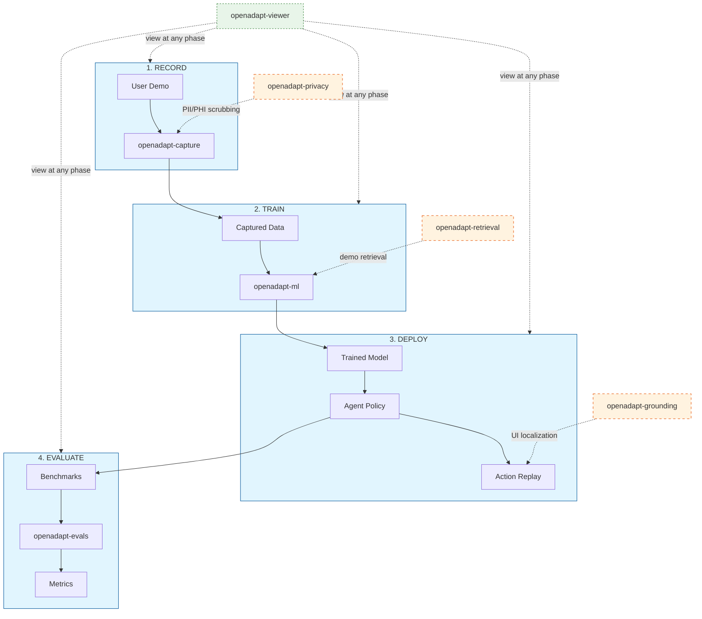

# OpenAdapt: AI-First Process Automation with Large Multimodal Models (LMMs)

[](https://github.com/OpenAdaptAI/OpenAdapt/actions)
[](https://pypi.org/project/openadapt/)
[](https://pypi.org/project/openadapt/)
[](https://opensource.org/licenses/MIT)
[](https://www.python.org/downloads/)

**OpenAdapt** is the **open** source software **adapt**er between Large Multimodal Models (LMMs) and traditional desktop and web GUIs.

Record GUI demonstrations, train ML models, and evaluate agents - all from a unified CLI.

[Join us on Discord](https://discord.gg/yF527cQbDG) | [Documentation](https://docs.openadapt.ai) | [OpenAdapt.ai](https://openadapt.ai)

---

## Architecture

OpenAdapt v1.0+ uses a **modular meta-package architecture**. The main `openadapt` package provides a unified CLI and depends on focused sub-packages via PyPI:

| Package | Description | Repository |
|---------|-------------|------------|
| `openadapt` | Meta-package with unified CLI | This repo |
| `openadapt-capture` | Event recording and storage | [openadapt-capture](https://github.com/OpenAdaptAI/openadapt-capture) |
| `openadapt-ml` | ML engine, training, inference | [openadapt-ml](https://github.com/OpenAdaptAI/openadapt-ml) |
| `openadapt-evals` | Benchmark evaluation | [openadapt-evals](https://github.com/OpenAdaptAI/openadapt-evals) |
| `openadapt-viewer` | HTML visualization | [openadapt-viewer](https://github.com/OpenAdaptAI/openadapt-viewer) |
| `openadapt-grounding` | UI element localization | [openadapt-grounding](https://github.com/OpenAdaptAI/openadapt-grounding) |
| `openadapt-retrieval` | Multimodal demo retrieval | [openadapt-retrieval](https://github.com/OpenAdaptAI/openadapt-retrieval) |
| `openadapt-privacy` | PII/PHI scrubbing | [openadapt-privacy](https://github.com/OpenAdaptAI/openadapt-privacy) |

---

## Installation

Install what you need:

```bash
pip install openadapt              # Minimal CLI only
pip install openadapt[capture]     # GUI capture/recording
pip install openadapt[ml]          # ML training and inference
pip install openadapt[evals]       # Benchmark evaluation
pip install openadapt[privacy]     # PII/PHI scrubbing
pip install openadapt[all]         # Everything
```

**Requirements:** Python 3.10+

---

## Quick Start

### 1. Record a demonstration

```bash
openadapt capture start --name my-task
# Perform actions in your GUI, then press Ctrl+C to stop
```

### 2. Train a model

```bash
openadapt train start --capture my-task --model qwen3vl-2b
```

### 3. Evaluate

```bash
openadapt eval run --checkpoint training_output/model.pt --benchmark waa
```

### 4. View recordings

```bash
openadapt capture view my-task
```

---

## CLI Reference

```
openadapt capture start --name <name>    Start recording
openadapt capture stop                    Stop recording
openadapt capture list                    List captures
openadapt capture view <name>             Open capture viewer

openadapt train start --capture <name>    Train model on capture
openadapt train status                    Check training progress
openadapt train stop                      Stop training

openadapt eval run --checkpoint <path>    Evaluate trained model
openadapt eval run --agent api-claude     Evaluate API agent
openadapt eval mock --tasks 10            Run mock evaluation

openadapt serve --port 8080               Start dashboard server
openadapt version                         Show installed versions
openadapt doctor                          Check system requirements
```

---

## How It Works

See the full [Architecture Documentation](docs/architecture.md) for detailed diagrams.



OpenAdapt:
- Records screenshots and user input events
- Trains ML models on demonstrations
- Generates and replays synthetic input via model completions
- Evaluates agents on GUI automation benchmarks

**Key differentiators:**
1. Model agnostic - works with any LMM
2. Auto-prompted from human demonstration (not user-prompted)
3. Works with all desktop GUIs including virtualized and web
4. Open source (MIT license)

---

## Key Concepts

### Meta-Package Structure

OpenAdapt v1.0+ uses a **modular architecture** where the main `openadapt` package acts as a meta-package that coordinates focused sub-packages:

- **Core Packages**: Essential for the main workflow
  - `openadapt-capture` - Records screenshots and input events
  - `openadapt-ml` - Trains models on demonstrations
  - `openadapt-evals` - Evaluates agents on benchmarks

- **Optional Packages**: Enhance specific workflow phases
  - `openadapt-privacy` - Integrates at **Record** phase for PII/PHI scrubbing
  - `openadapt-retrieval` - Integrates at **Train** phase for multimodal demo retrieval
  - `openadapt-grounding` - Integrates at **Deploy** phase for UI element localization

- **Independent Components**:
  - `openadapt-viewer` - HTML visualization that works with any phase

### Two Paths to Automation

1. **Custom Training Path**: Record demonstrations -> Train your own model -> Deploy agent
   - Best for: Repetitive tasks specific to your workflow
   - Requires: `openadapt[core]`

2. **API Agent Path**: Use pre-trained LMM APIs (Claude, GPT-4V, etc.) -> Evaluate on benchmarks
   - Best for: General-purpose automation, rapid prototyping
   - Requires: `openadapt[evals]`

---

## Installation Paths

Choose your installation based on your use case:

```
What do you want to do?
|
+-- Just evaluate API agents on benchmarks?
|   +-- pip install openadapt[evals]
|
+-- Train custom models on your demonstrations?
|   +-- pip install openadapt[core]
|
+-- Full suite with all optional packages?
|   +-- pip install openadapt[all]
|
+-- Minimal CLI only (add packages later)?
    +-- pip install openadapt
```

| Installation | Included Packages | Use Case |
|-------------|-------------------|----------|
| `openadapt` | CLI only | Start minimal, add what you need |
| `openadapt[evals]` | + evals | Benchmark API agents (Claude, GPT-4V) |
| `openadapt[core]` | + capture, ml, viewer | Full training workflow |
| `openadapt[all]` | + privacy, retrieval, grounding | Everything including optional enhancements |

---

## Demos

- https://twitter.com/abrichr/status/1784307190062342237
- https://www.loom.com/share/9d77eb7028f34f7f87c6661fb758d1c0

---

## Permissions

**macOS:** Grant Accessibility, Screen Recording, and Input Monitoring permissions to your terminal. See [permissions guide](./legacy/permissions_in_macOS.md).

**Windows:** Run as Administrator if needed for input capture.

---

## Legacy Version

The monolithic OpenAdapt codebase (v0.46.0) is preserved in the `legacy/` directory.

**To use the legacy version:**
```bash
pip install openadapt==0.46.0
```

See [docs/LEGACY_FREEZE.md](docs/LEGACY_FREEZE.md) for migration guide and details.

---

## Contributing

1. [Join Discord](https://discord.gg/yF527cQbDG)
2. Pick an issue from the relevant sub-package repository
3. Submit a PR

For sub-package development:
```bash
git clone https://github.com/OpenAdaptAI/openadapt-ml  # or other sub-package
cd openadapt-ml
pip install -e ".[dev]"
```

---

## Related Projects

- [OpenAdaptAI/SoM](https://github.com/OpenAdaptAI/SoM) - Set-of-Mark prompting
- [OpenAdaptAI/pynput](https://github.com/OpenAdaptAI/pynput) - Input monitoring fork
- [OpenAdaptAI/atomacos](https://github.com/OpenAdaptAI/atomacos) - macOS accessibility

---

## Support

- **Discord:** https://discord.gg/yF527cQbDG
- **Issues:** Use the relevant sub-package repository
- **Architecture docs:** [GitHub Wiki](https://github.com/OpenAdaptAI/OpenAdapt/wiki/OpenAdapt-Architecture-(draft))

---

## License

MIT License - see [LICENSE](LICENSE) for details.
