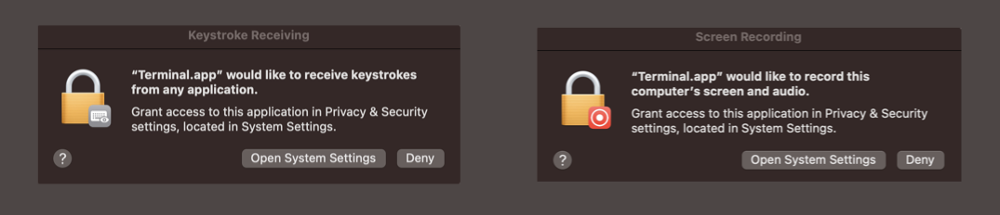

[Join us on Slack](https://join.slack.com/t/mldsai/shared_invite/zt-1uf94nn7r-qcQnS~hinLPKftUapNzbuw)

# OpenAdapt: AI-First Process Automation with Transformers

Welcome to OpenAdapt! This Python library implements AI-First Process Automation
with the power of Transformers by:

- Recording screenshots and associated user input
- Aggregating and visualizing user input and recordings for development
- Converting screenshots and user input into tok/enized format
- Generating synthetic input via transformer model completions
- Replaying synthetic input to complete tasks

The goal is similar to that of
[Robotic Process Automation](https://en.wikipedia.org/wiki/Robotic_process_automation),
except that we use transformers instead of conventional RPA tools.

The approach is similar to [adept.ai](https://adept.ai/), with some key differences:
1. Instead of requiring the user to prompt the model directly, we prompt it behind the
scenes by observing the user's activities;
2. We work with all types of desktop applications, not just web apps;
3. We're open source!

## Install

```
git clone https://github.com/MLDSAI/OpenAdapt.git
cd OpenAdapt
python3.10 -m venv .venv
source .venv/bin/activate
pip install wheel
pip install -r requirements.txt
pip install -e .
alembic upgrade head
pytest
```

## Permissions

See how to set up system permissions on macOS [here](./permissions_in_macOS.md).

## Run

### Record

Create a new recording by running the following command:

```
python -m openadapt.record "testing out openadapt"
```

Wait until all three event writers have started:
```
| INFO     | __mp_main__:write_events:230 - event_type='screen' starting
| INFO     | __mp_main__:write_events:230 - event_type='action' starting
| INFO     | __mp_main__:write_events:230 - event_type='window' starting
```

Type a few words into the terminal and move your mouse around the screen
to generate some events, then stop the recording by pressing CTRL+C.

Current limitations: 
- recording should be short (i.e. under a minute), as they are
somewhat memory intensive, and there is currently an
[open issue](https://github.com/MLDSAI/OpenAdapt/issues/5) describing a
possible memory leak
- the only touchpad and trackpad gestures currently supported are 
pointing the cursor and left or right clicking, as described in this
[open issue](https://github.com/MLDSAI/OpenAdapt/issues/145)


### Visualize

Visualize the latest recording you created by running the following command:

```
python -m openadapt.visualize
```

This will open your browser. It will look something like this:


### Playback

You can play back the recording using the following command:

```
python -m openadapt.replay NaiveReplayStrategy
```

More ReplayStrategies coming soon! (see [Contributing](#Contributing)).


## Contributing

### Design

### Problem Statement

Our goal is to automate the task described and demonstrated in a `Recording`.
That is, given a new `Screenshot`, we want to generate the appropriate
`ActionEvent`(s) based on the previously recorded `ActionEvent`s in order to
accomplish the task specified in the `Recording.task_description`, while
accounting for differences in screen resolution, window size, application
behavior, etc.

If it's not clear what `ActionEvent` is appropriate for the given `Screenshot`,
(e.g. if the GUI application is behaving in a way we haven't seen before),
we can ask the user to take over temporarily to demonstrate the appropriate
course of action.

### Dataset

The dataset consists of the following entities: 
1. `Recording`: Contains information about the screen dimensions, platform, and
   other metadata.
2. `ActionEvent`: Represents a user action event such as a mouse click or key
   press. Each `ActionEvent` has an associated `Screenshot` taken immediately
   before the event occurred. `ActionEvent`s are aggregated to remove
   unnecessary events (see [visualize](#visualize).)
3. `Screenshot`: Contains the PNG data of a screenshot taken during the
   recording.
4. `WindowEvent`: Represents a window event such as a change in window title,
   position, or size.

You can assume that you have access to the following functions: 
- `create_recording("doing taxes")`: Creates a recording.
- `get_latest_recording()`: Gets the latest recording.
- `get_events(recording)`: Returns a list of `ActionEvent` objects for the given
  recording.

### Instructions

[Join us on Slack](https://join.slack.com/t/mldsai/shared_invite/zt-1uf94nn7r-qcQnS~hinLPKftUapNzbuw). Then:

1. Fork this repository and clone it to your local machine. 
2. Get OpenAdapt up and running by following the instructions under [Setup](#Setup).
3. Look through the list of open issues at https://github.com/MLDSAI/OpenAdapt/issues
and once you find one you would like to address, indicate your interest with a comment.
4. Implement a solution to the issue you selected. Write unit tests for your
implementation.
5. Submit a Pull Request (PR) to this repository. Note: submitting a PR before your
implementation is complete (e.g. with high level documentation and/or implementation
stubs) is encouraged, as it provides us with the opportunity to provide early
feedback and iterate on the approach.

### Evaluation Criteria

Your submission will be evaluated based on the following criteria: 

1. **Functionality** : Your implementation should correctly generate the new
   `ActionEvent` objects that can be replayed in order to accomplish the task in
   the original recording.

2. **Code Quality** : Your code should be well-structured, clean, and easy to
   understand.

3. **Scalability** : Your solution should be efficient and scale well with
   large datasets.

4. **Testing** : Your tests should cover various edge cases and scenarios to
   ensure the correctness of your implementation.

### Submission

1. Commit your changes to your forked repository.

2. Create a pull request to the original repository with your changes.

3. In your pull request, include a brief summary of your approach, any
   assumptions you made, and how you integrated external libraries.

4. *Bonus*: interacting with ChatGPT and/or other language transformer models
   in order to generate code and/or evaluate design decisions is encouraged. If
   you choose to do so, please include the full transcript.


## We're hiring!

If you're interested in getting paid for your work, please mention it in your Pull Request.

## Troubleshooting

MacOS: if you encounter system alert messages or find issues when making and replaying recordings, make sure to [set up permissions accordingly](./permissions_in_macOS.md).



In summary (from https://stackoverflow.com/a/69673312):

1. Settings -> Security & Privacy
2. Click on the Privacy tab
3. Scroll and click on the Accessibility Row
4. Click +
5. Navigate to /System/Applications/Utilities/ (or wherever Terminal.app is installed)
6. Click okay.

## Developing

### Generate migration (after editing a model)

```
alembic revision --autogenerate -m "<msg>"
```

# Submitting an Issue

Please submit any issues to https://github.com/MLDSAI/openadapt/issues with the
following information:

- Problem description (please include any relevant console output and/or screenshots)
- Steps to reproduce (please help others to help you!)
