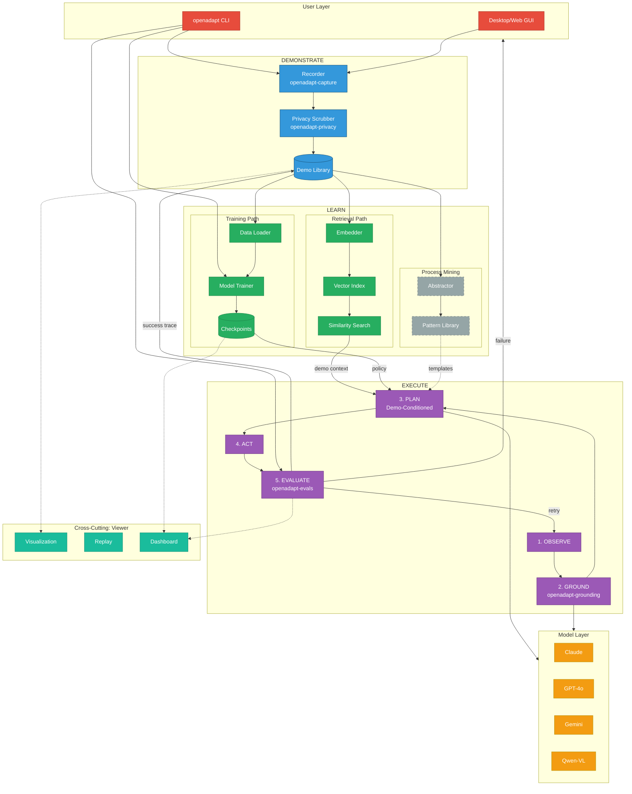
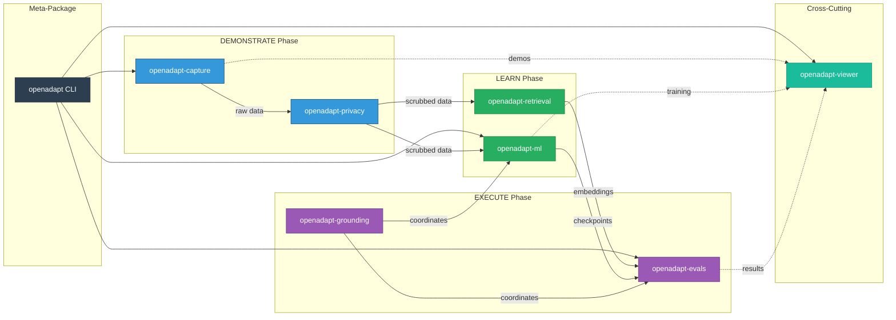
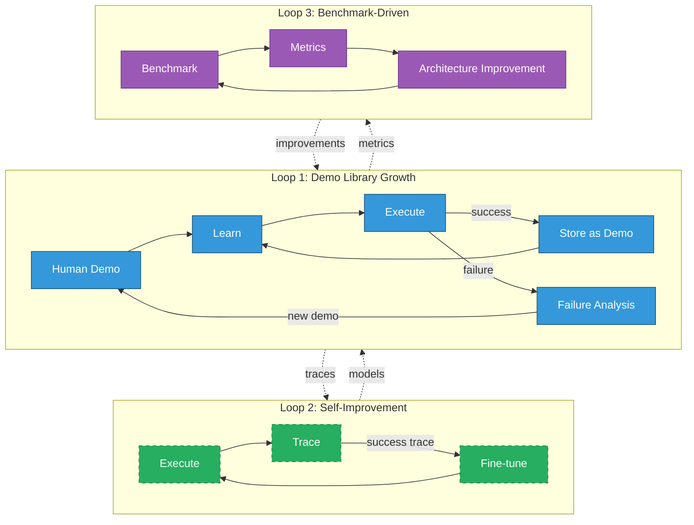

# OpenAdapt Architecture Evolution

**Version**: 3.0
**Date**: January 2026
**Status**: Living Document

---

## Executive Summary

This document traces the evolution of OpenAdapt from its original alpha vision through the modern modular implementation, synthesizing state-of-the-art GUI agent research into a unified framework. OpenAdapt's core innovation is **demonstration-conditioned automation**: "show, don't tell."

---

## Table of Contents

1. [Original Alpha Vision](#1-original-alpha-vision)
2. [The Abstraction Ladder](#2-the-abstraction-ladder)
3. [Core Innovation: Demo-Conditioned Agents](#3-core-innovation-demo-conditioned-agents)
4. [Modern Architecture](#4-modern-architecture)
5. [SOTA GUI Agent Integration](#5-sota-gui-agent-integration)
6. [Package Responsibilities](#6-package-responsibilities)
7. [Feedback Loops](#7-feedback-loops)
8. [Implementation Status](#8-implementation-status)
9. [Architecture Evolution Diagrams](#9-architecture-evolution-diagrams)
10. [Future Directions](#10-future-directions)

---

## 1. Original Alpha Vision

### The Three-Stage Pipeline (2023)

OpenAdapt was conceived as a three-stage pipeline for AI-first process automation:

```
+=====================+     +=====================+     +=====================+
|                     |     |                     |     |                     |
|      RECORDING      | --> |      ANALYSIS       | --> |       REPLAY        |
|                     |     |                     |     |                     |
|  Capture human      |     |  Convert to         |     |  Generate and       |
|  demonstrations:    |     |  tokenized format   |     |  replay synthetic   |
|  - Screenshots      |     |  for LMM            |     |  input via model    |
|  - User input       |     |  processing         |     |  completions        |
|                     |     |                     |     |                     |
+=====================+     +=====================+     +=====================+
```

### Original Design Goals

From the legacy README:

> "The goal is similar to that of Robotic Process Automation (RPA), except that we use Large Multimodal Models instead of conventional RPA tools."

**Key Differentiators (Alpha)**:
1. **Model Agnostic** - Works with any LMM
2. **Auto-Prompted** - Learns from demonstration, not user prompts
3. **Grounded in Existing Processes** - Mitigates hallucinations
4. **Universal GUI Support** - Desktop, web, and virtualized (Citrix)
5. **Open Source** - MIT license

### Legacy Monolithic Implementation

The alpha codebase (`legacy/openadapt/`) implemented:

```
openadapt/
  record.py           # Screenshot/event capture
  replay.py           # Strategy-based playback
  models.py           # Recording, ActionEvent, Screenshot, WindowEvent
  events.py           # Event aggregation/processing
  strategies/
    base.py           # BaseReplayStrategy abstract class
    naive.py          # Direct literal replay
    stateful.py       # GPT-4 + OS-level window data
    vanilla.py        # Full VLM reasoning per step
    visual.py         # FastSAM segmentation
    visual_browser.py # DOM-based segments
  adapters/
    anthropic.py      # Claude API integration
    openai.py         # GPT API integration
    replicate.py      # Open-source model hosting
  privacy/
    base.py           # Scrubbing provider interface
    providers/        # Presidio, AWS Comprehend, Private AI
```

### The Strategy Pattern (Original)

The original architecture used a `BaseReplayStrategy` abstract class:

```python
class BaseReplayStrategy(ABC):
    """Base class for implementing replay strategies."""

    def __init__(self, recording: Recording) -> None:
        self.recording = recording
        self.action_events = []
        self.screenshots = []
        self.window_events = []

    @abstractmethod
    def get_next_action_event(
        self,
        screenshot: Screenshot,
        window_event: WindowEvent,
    ) -> ActionEvent:
        """Get the next action based on current observation."""
        pass

    def run(self) -> None:
        """Execute the replay loop."""
        while True:
            screenshot = Screenshot.take_screenshot()
            window_event = WindowEvent.get_active_window_event()
            action_event = self.get_next_action_event(screenshot, window_event)
            if action_event:
                playback.play_action_event(action_event, ...)
```

This pattern evolved into the modern policy/grounding separation.

### Alpha Data Model

```python
class Recording:
    """Container for a demonstration session."""
    id: int
    timestamp: float
    task_description: str
    action_events: list[ActionEvent]
    screenshots: list[Screenshot]
    window_events: list[WindowEvent]

class ActionEvent:
    """A single user action (click, type, scroll, etc.)."""
    name: str                    # "click", "type", "scroll", "press", "release"
    timestamp: float
    screenshot: Screenshot       # Screenshot just before action
    window_event: WindowEvent    # Active window state
    mouse_x, mouse_y: int        # Mouse coordinates
    key_char, key_name: str      # Keyboard input
    element_state: dict          # Accessibility info

class Screenshot:
    """A captured screen image."""
    timestamp: float
    png_data: bytes
    image: PIL.Image
```

---

## 2. The Abstraction Ladder

### Core Concept: Progressive Abstraction

OpenAdapt processes demonstrations through ascending levels of abstraction, enabling generalization and transfer learning.

```
+=========================================================================+
|                                                                         |
|  Level 4: GOAL (Task Specification)                              FUTURE |
|  "Say hello to the customer"                                            |
|                                                                         |
|           ^                                                             |
|           | Goal Composition (high-level planning)                      |
|           |                                                             |
+=========================================================================+
|                                                                         |
|  Level 3: SEMANTIC (Intent Recognition)                         FUTURE |
|  { action: "greet", target: "user" }                                    |
|                                                                         |
|           ^                                                             |
|           | Process Mining (discover patterns)                          |
|           |                                                             |
+=========================================================================+
|                                                                         |
|  Level 2: TEMPLATE (Parameterized Actions)                      PARTIAL |
|  { type: "hi <firstname>" }                                             |
|                                                                         |
|           ^                                                             |
|           | Anonymization (extract parameters)                          |
|           |                                                             |
+=========================================================================+
|                                                                         |
|  Level 1: SYMBOLIC (Semantic Actions)                       IMPLEMENTED |
|  { type: "hi bob" }                                                     |
|                                                                         |
|           ^                                                             |
|           | Reduction (aggregate consecutive events)                    |
|           |                                                             |
+=========================================================================+
|                                                                         |
|  Level 0: LITERAL (Raw Events)                              IMPLEMENTED |
|  { press: "h" }, { press: "i" }, { press: " " }, { press: "b" }, ...    |
|                                                                         |
+=========================================================================+
```

### Abstraction Level Details

| Level | Name | Representation | Transformation | Status |
|-------|------|----------------|----------------|--------|
| 0 | **Literal** | Raw keypresses, mouse coords | None (raw capture) | **Implemented** |
| 1 | **Symbolic** | Aggregated actions (`type "hello"`) | Event reduction | **Implemented** |
| 2 | **Template** | Parameterized (`type "<greeting>"`) | Regex extraction | **Partial** |
| 3 | **Semantic** | Intent-level (`greet user`) | LLM intent recognition | **Research** |
| 4 | **Goal** | Task description ("Welcome customer") | Goal composition | **Future** |

### Why Abstraction Matters

| Level | Enables | Example Use Case |
|-------|---------|------------------|
| Literal | Exact replay, debugging | Audit trails, regression tests |
| Symbolic | Human-readable logs | Training data visualization |
| Template | Parameterized replay | Same task, different data |
| Semantic | Cross-application transfer | Greeting in any messaging app |
| Goal | Natural language control | "Greet the next customer" |

### Current Implementation

**Literal to Symbolic** (`openadapt-capture`):
- Event aggregation in `events.py`
- Consecutive keypresses become `type` actions
- Mouse drags become `drag` actions
- Click sequences become `doubleclick` or `tripleclick`

**Symbolic to Template** (Partial):
- Regex-based parameter extraction
- User-defined placeholders

**Template to Semantic** (Research):
- LLM-based intent recognition
- Pattern library discovery

**Semantic to Goal** (Future):
- Process mining algorithms
- Cross-demo pattern extraction

---

## 3. Core Innovation: Demo-Conditioned Agents

### The Fundamental Differentiator

OpenAdapt's core insight is **demonstration-conditioned automation**: "show, don't tell."

```
+-------------------------------------------------------------------+
|                     TRADITIONAL APPROACH                           |
+-------------------------------------------------------------------+
|                                                                    |
|  User: "Click the submit button"                                   |
|                                                                    |
|  Agent: [Which submit button? What context? What state?]           |
|         [Multiple submit buttons on page?]                         |
|         [Different applications have different buttons]            |
|                                                                    |
|  Result: AMBIGUOUS -> Requires prompt engineering                  |
|                                                                    |
+-------------------------------------------------------------------+

+-------------------------------------------------------------------+
|                    DEMO-CONDITIONED APPROACH                       |
+-------------------------------------------------------------------+
|                                                                    |
|  User: [Records clicking the blue "Submit Order" button            |
|         after filling out form fields]                             |
|                                                                    |
|  Agent: [Learns full context:                                      |
|          - Form state before action                                |
|          - Button appearance and location                          |
|          - Preceding actions in sequence                           |
|          - Window/application context]                             |
|                                                                    |
|  Result: GROUNDED -> No prompt engineering needed                  |
|                                                                    |
+-------------------------------------------------------------------+
```

### Why Demo-Conditioning Works

1. **Captures Implicit Knowledge**: Users demonstrate things they can't easily verbalize
2. **Grounded in Reality**: Actions tied to actual UI states, not abstract descriptions
3. **Reduces Ambiguity**: Visual context eliminates interpretation errors
4. **Lower Barrier**: No prompt engineering skills required

### Empirical Results

Demo conditioning improves first-action accuracy:

| Approach | First-Action Accuracy | Notes |
|----------|----------------------|-------|
| Prompt-only | ~33% | Ambiguity in action selection |
| Demo-conditioned | ~100% | Full context from demonstration |

### The "Show, Don't Tell" Principle

```python
# Traditional: Prompt-driven
agent.execute("Click the submit button")
# -> Which submit button? What state? What context?

# Demo-Conditioned: Demonstration-driven
demo = capture_demonstration()  # User clicks specific submit button
agent = train_policy(demo)      # Agent learns the full context
agent.execute(new_context)      # Agent adapts to variations
```

---

## 4. Modern Architecture

### Evolution: Monolith to Meta-Package

```
ALPHA (2023-2024)                        MODERN (2025+)
+====================+                   +====================+
|                    |                   |     openadapt      |
|     openadapt      |                   |    (meta-pkg)      |
|    (monolithic)    |                   +=========+=========+
|                    |                             |
|  - record.py       |           +-----------------+-----------------+
|  - replay.py       |           |         |       |       |         |
|  - strategies/     |      +----+----+ +--+--+ +--+--+ +--+--+ +----+----+
|  - models.py       |      |capture  | | ml  | |evals| |viewer| |optional |
|  - adapters/       |      +---------+ +-----+ +-----+ +------+ +---------+
|  - privacy/        |
|  - visualize.py    |      + grounding, retrieval, privacy
|                    |
+====================+
```

### The Modern Three-Phase Architecture

Building on the alpha vision, the modern architecture formalizes three phases:

```
+=======================+     +=======================+     +=======================+
||                     ||     ||                     ||     ||                     ||
||     DEMONSTRATE     || --> ||       LEARN         || --> ||      EXECUTE        ||
||                     ||     ||                     ||     ||                     ||
||  (Observation       ||     ||  (Policy            ||     ||  (Agent             ||
||   Collection)       ||     ||   Acquisition)      ||     ||   Deployment)       ||
||                     ||     ||                     ||     ||                     ||
||  Packages:          ||     ||  Packages:          ||     ||  Packages:          ||
||  - capture          ||     ||  - ml               ||     ||  - evals            ||
||  - privacy          ||     ||  - retrieval        ||     ||  - grounding        ||
||                     ||     ||                     ||     ||                     ||
+=======================+     +=======================+     +=======================+
```

### Phase 1: DEMONSTRATE (Observation Collection)

**Purpose**: Capture rich trajectories from human demonstrations.

**Inputs**:
- User performs task in target application
- Optional: Task description, success criteria, audio narration

**Outputs**:
- Screenshot sequences (PNG/JPEG)
- Input events (mouse, keyboard, touch)
- Accessibility tree snapshots (a11y)
- Window metadata (title, bounds, process)
- Audio transcription (optional)

**Packages**: `openadapt-capture`, `openadapt-privacy`

### Phase 2: LEARN (Policy Acquisition)

**Purpose**: Transform demonstrations into executable agent policies.

**Three Learning Paths**:

| Path | Mechanism | Advantage | Package |
|------|-----------|-----------|---------|
| **A: Retrieval-Augmented** | Index demos, retrieve similar | No training needed | `openadapt-retrieval` |
| **B: Fine-Tuning** | Train VLM on demo dataset | Specialized performance | `openadapt-ml` |
| **C: Process Mining** | Extract reusable patterns | Cross-task transfer | `openadapt-ml` (future) |

### Phase 3: EXECUTE (Agent Deployment)

**Purpose**: Run trained/conditioned agents autonomously.

**Execution Loop**:
```
while not task_complete:
    1. OBSERVE    - Capture screenshot + a11y tree
    2. GROUND     - Localize UI elements (SoM, OmniParser)
    3. PLAN       - VLM reasoning with demo context
    4. ACT        - Execute via input synthesis
    5. EVALUATE   - Check success, decide next step
```

**Packages**: `openadapt-evals`, `openadapt-grounding`, `openadapt-ml`

---

## 5. SOTA GUI Agent Integration

### Policy/Grounding Separation

From Claude Computer Use, UFO, and SeeAct research:

```
+====================+          +====================+
|                    |          |                    |
|      POLICY        |    -->   |     GROUNDING      |
|                    |          |                    |
|   "What to do"     |          |   "Where to do"    |
|                    |          |                    |
| - Observation      |          | - Element          |
|   encoding         |          |   detection        |
| - Action           |          | - Coordinate       |
|   selection        |          |   mapping          |
| - History          |          | - Bounding         |
|   context          |          |   boxes            |
|                    |          |                    |
+====================+          +====================+
```

**OpenAdapt Implementation**:
- **Policy**: `openadapt-ml` adapters (Claude, GPT-4V, Qwen-VL)
- **Grounding**: `openadapt-grounding` providers (OmniParser, Florence2, Gemini)

### Set-of-Mark (SoM) Prompting

From Microsoft's Set-of-Mark paper:

```
Original Screenshot              SoM-Annotated Screenshot
+---------------------+          +---------------------+
|  [Login]   [Help]   |          |   [1]      [2]      |
|                     |    ->    |                     |
|  Email: [________]  |          |  Email: [3]         |
|  Pass:  [________]  |          |  Pass:  [4]         |
|         [Submit]    |          |         [5]         |
+---------------------+          +---------------------+

Prompt: "Enter email in element [3], password in [4], click [5]"
```

**OpenAdapt Implementation**: `openadapt-grounding.SoMPrompt`

### Safety Gates

From responsible AI patterns:

```
+------------------+     +------------------+     +------------------+
|                  |     |                  |     |                  |
|     OBSERVE      | --> |    VALIDATE      | --> |      ACT         |
|                  |     |                  |     |                  |
|  Get current     |     |  - Check bounds  |     |  Execute if      |
|  state           |     |  - Verify perms  |     |  validated       |
|                  |     |  - Rate limit    |     |                  |
+------------------+     +--------+---------+     +------------------+
                                 |
                                 v (rejected)
                         +------------------+
                         |    ESCALATE      |
                         |  Human review    |
                         +------------------+
```

**Status**: Planned in `openadapt-evals` safety module.

### Research Alignment

| Research Paper | Key Contribution | OpenAdapt Integration |
|----------------|------------------|----------------------|
| **Claude Computer Use** (Anthropic, 2024) | Production VLM agent API | API adapter in `openadapt-ml` |
| **UFO** (Microsoft, 2024) | Windows agent architecture | Prompt patterns adopted |
| **OSWorld** (CMU, 2024) | Cross-platform benchmark | Benchmark adapter planned |
| **Set-of-Mark** (Microsoft, 2023) | Visual grounding via labels | Core grounding mode |
| **OmniParser** (Microsoft, 2024) | Pure-vision UI parsing | Provider in `openadapt-grounding` |
| **SeeAct** (OSU, 2024) | Grounded action generation | Action space design |
| **WebArena** (CMU, 2023) | Web automation benchmark | Benchmark adapter implemented |
| **AppAgent** (Tencent, 2024) | Mobile GUI agent | Mobile support planned |

---

## 6. Package Responsibilities

### Package-to-Phase Mapping

```
+===============================================================================+
|                           DEMONSTRATE PHASE                                    |
+===============================================================================+
| Package           | Responsibility             | Key Exports                  |
+-------------------+----------------------------+------------------------------+
| openadapt-capture | GUI recording, storage     | Recorder, CaptureSession     |
|                   |                            | Action, Screenshot, Trajectory|
+-------------------+----------------------------+------------------------------+
| openadapt-privacy | PII/PHI scrubbing          | Scrubber, Redactor           |
|                   | (integrates at capture)    | PrivacyFilter                |
+===============================================================================+

+===============================================================================+
|                             LEARN PHASE                                        |
+===============================================================================+
| Package             | Responsibility           | Key Exports                  |
+---------------------+--------------------------+------------------------------+
| openadapt-ml        | Model training,          | Trainer, AgentPolicy         |
|                     | inference, adapters      | QwenVLAdapter, ClaudeAdapter |
+---------------------+--------------------------+------------------------------+
| openadapt-retrieval | Demo embedding,          | DemoIndex, Embedder          |
|                     | similarity search        | SearchResult                 |
+===============================================================================+

+===============================================================================+
|                            EXECUTE PHASE                                       |
+===============================================================================+
| Package              | Responsibility          | Key Exports                  |
+----------------------+-------------------------+------------------------------+
| openadapt-evals      | Benchmark evaluation,   | BenchmarkAdapter, ApiAgent   |
|                      | metrics collection      | evaluate_agent_on_benchmark  |
+----------------------+-------------------------+------------------------------+
| openadapt-grounding  | UI element detection,   | ElementDetector, SoMPrompt   |
|                      | coordinate mapping      | OmniParser, GeminiGrounder   |
+===============================================================================+

+===============================================================================+
|                           CROSS-CUTTING                                        |
+===============================================================================+
| Package           | Responsibility             | Key Exports                  |
+-------------------+----------------------------+------------------------------+
| openadapt-viewer  | HTML visualization,        | PageBuilder, HTMLBuilder     |
|                   | trajectory replay          | TrajectoryViewer             |
+-------------------+----------------------------+------------------------------+
| openadapt         | Unified CLI,               | cli.main, lazy imports       |
| (meta-package)    | dependency coordination    |                              |
+===============================================================================+
```

### Package Dependency Matrix

```
                    capture  ml  evals  viewer  grounding  retrieval  privacy
openadapt-capture      -     -    -       -        -          -          O
openadapt-ml           R     -    -       -        O          O          -
openadapt-evals        -     R    -       O        O          O          -
openadapt-viewer       O     O    O       -        -          -          O
openadapt-grounding    -     -    -       -        -          -          -
openadapt-retrieval    R     -    -       -        -          -          -
openadapt-privacy      -     -    -       -        -          -          -

Legend: R = Required, O = Optional, - = None
```

---

## 7. Feedback Loops

### System-Level Feedback Architecture

```
                              DEMONSTRATE
                                   |
                                   | Human demonstrations
                                   v
+-----------------------------> LEARN <----------------------------+
|                                  |                               |
|                                  | Trained policies              |
|   +-----------------------------|---------------------+          |
|   |                             v                     |          |
|   |   +----------------->  EXECUTE  <--------------+  |          |
|   |   |                       |                    |  |          |
|   |   | Retry on              | Success/Failure   |  |          |
|   |   | recoverable           | outcomes          |  |          |
|   |   | errors                v                   |  |          |
|   |   |               +-------+-------+           |  |          |
|   |   |               |               |           |  |          |
|   |   +---------------+   EVALUATE    +-----------+  |          |
|   |   (Loop 1: Retry) |               |              |          |
|   |                   +-------+-------+              |          |
|   |                           |                      |          |
|   |                           | Execution traces     |          |
|   |                           v                      |          |
|   |                   Demo library grows             |          |
|   |                           |                      |          |
|   +---------------------------+                      |          |
|   (Loop 2: Library Growth)                           |          |
|                                                      |          |
|   Failure analysis identifies gaps                   |          |
|                    |                                 |          |
|                    v                                 |          |
|           Human correction                           |          |
|                    |                                 |          |
+--------------------+                                 |          |
(Loop 3: Human-in-Loop)                                |          |
                                                       |          |
                     Self-improvement loop             |          |
                     (execution traces -> training)    |          |
                              |                        |          |
                              +------------------------+          |
                              (Loop 4: Self-Improvement)          |
                                                                  |
             Benchmark-driven development                         |
             (eval results -> architecture improvements)          |
                              |                                   |
                              +-----------------------------------+
                              (Loop 5: Benchmark-Driven)
```

### Feedback Loop Details

| Loop | Name | Trigger | Outcome | Status |
|------|------|---------|---------|--------|
| 1 | **Retry** | Recoverable error | Re-attempt action | **Implemented** |
| 2 | **Library Growth** | Successful execution | New demo added | **Implemented** |
| 3 | **Human-in-Loop** | Unrecoverable failure | Human correction -> demo | **Implemented** |
| 4 | **Self-Improvement** | Execution traces | Fine-tuning | **Research** |
| 5 | **Benchmark-Driven** | Eval metrics | Architecture changes | **Active** |

---

## 8. Implementation Status

### What's Implemented vs Future Work

```
+==============================================================================+
|                    IMPLEMENTED (Solid)                                        |
+==============================================================================+
| Component                | Package          | Notes                          |
+--------------------------+------------------+--------------------------------+
| Screen capture           | capture          | macOS, Windows, Linux          |
| Event recording          | capture          | Mouse, keyboard, touch         |
| Event aggregation        | capture          | Literal -> Symbolic            |
| A11y tree capture        | capture          | macOS, Windows                 |
| Demo storage             | capture          | JSON/Parquet/PNG               |
| Privacy scrubbing        | privacy          | Presidio, AWS Comprehend       |
| Demo embedding           | retrieval        | CLIP, SigLIP                   |
| Vector indexing          | retrieval        | FAISS, Annoy                   |
| Similarity search        | retrieval        | Top-k retrieval                |
| API model adapters       | ml               | Claude, GPT-4V, Gemini         |
| Element detection        | grounding        | OmniParser, Florence2          |
| SoM annotation           | grounding        | Numbered element labels        |
| WAA benchmark            | evals            | Full integration               |
| Mock benchmark           | evals            | Testing infrastructure         |
| HTML visualization       | viewer           | Trajectory replay              |
| Unified CLI              | openadapt        | capture/train/eval/view        |
+==============================================================================+

+==============================================================================+
|                    IN PROGRESS (Dashed)                                       |
+==============================================================================+
| Component                | Package          | Notes                          |
+--------------------------+------------------+--------------------------------+
| Training pipeline        | ml               | Qwen-VL fine-tuning            |
| LoRA adapters            | ml               | Parameter-efficient training   |
| Template extraction      | capture          | Regex-based parameterization   |
| WebArena benchmark       | evals            | Browser automation             |
| Training dashboard       | viewer           | Loss/metrics visualization     |
| Audio transcription      | capture          | Whisper integration            |
+--------------------------+------------------+--------------------------------+

+==============================================================================+
|                    FUTURE WORK (Dotted)                                       |
+==============================================================================+
| Component                | Package          | Notes                          |
+--------------------------+------------------+--------------------------------+
| Process mining           | ml (future)      | Semantic action discovery      |
| Goal composition         | ml (future)      | High-level task planning       |
| Self-improvement         | ml (future)      | Training on execution traces   |
| OSWorld benchmark        | evals            | Cross-platform desktop         |
| Multi-agent collaboration| ml (future)      | Agent coordination             |
| Active learning          | ml (future)      | Human feedback integration     |
| Mobile platform          | capture          | iOS, Android                   |
| Safety gates             | evals            | Action validation layer        |
+==============================================================================+
```

### Abstraction Ladder Implementation Status

| Level | Name | Status | Implementation |
|-------|------|--------|----------------|
| 0 | Literal | **Implemented** | Raw event recording in `capture` |
| 1 | Symbolic | **Implemented** | Event aggregation in `capture` |
| 2 | Template | **Partial** | Regex extraction in `capture` |
| 3 | Semantic | **Research** | LLM intent recognition |
| 4 | Goal | **Future** | Process mining |

---

## 9. Architecture Evolution Diagrams

### Era 1: Alpha Monolith (2023)

```
+=========================================================================+
|                        ALPHA ARCHITECTURE (2023)                         |
+=========================================================================+
|                                                                          |
|   +------------------------------------------------------------------+  |
|   |                       openadapt (monolithic)                      |  |
|   +------------------------------------------------------------------+  |
|   |                                                                   |  |
|   |   +-------------+    +-------------+    +-------------+          |  |
|   |   |   record    | -> |  visualize  | -> |   replay    |          |  |
|   |   +-------------+    +-------------+    +-------------+          |  |
|   |         |                  |                  |                  |  |
|   |         v                  v                  v                  |  |
|   |   +-------------+    +-------------+    +------------------+     |  |
|   |   |   models    |    |  plotting   |    |   strategies/    |     |  |
|   |   | - Recording |    | - HTML gen  |    |   - base.py      |     |  |
|   |   | - ActionEvt |    |             |    |   - naive.py     |     |  |
|   |   | - Screenshot|    |             |    |   - vanilla.py   |     |  |
|   |   | - WindowEvt |    |             |    |   - visual.py    |     |  |
|   |   +-------------+    +-------------+    +------------------+     |  |
|   |         |                                       |                |  |
|   |         v                                       v                |  |
|   |   +-------------+                       +---------------+        |  |
|   |   |    db/      |                       |   adapters/   |        |  |
|   |   | - SQLite    |                       | - anthropic   |        |  |
|   |   | - CRUD ops  |                       | - openai      |        |  |
|   |   +-------------+                       | - replicate   |        |  |
|   |                                         +---------------+        |  |
|   +------------------------------------------------------------------+  |
|                                                                          |
+=========================================================================+

Characteristics:
- Single repository, single package
- Tightly coupled components
- Strategy pattern for replay variants
- SQLite + Alembic migrations
- Prompts embedded in code
```

### Era 2: Transition (2024)

```
+=========================================================================+
|                     TRANSITION ARCHITECTURE (2024)                       |
+=========================================================================+
|                                                                          |
|   Legacy codebase frozen -> /legacy/                                     |
|                                                                          |
|   New modular packages designed:                                         |
|                                                                          |
|   +-------------+  +-------------+  +-------------+  +-------------+    |
|   |   capture   |  |     ml      |  |    evals    |  |   viewer    |    |
|   +-------------+  +-------------+  +-------------+  +-------------+    |
|   |   privacy   |  |  retrieval  |  |  grounding  |                     |
|   +-------------+  +-------------+  +-------------+                     |
|                                                                          |
|   Key changes:                                                           |
|   - Separate PyPI packages                                               |
|   - Lazy imports for optional deps                                       |
|   - Unified CLI in meta-package                                          |
|   - Policy/grounding separation                                          |
|   - Benchmark-first development                                          |
|                                                                          |
+=========================================================================+
```

### Era 3: Modern Meta-Package (2025+)

```
+=========================================================================+
|                    MODERN ARCHITECTURE (2025+)                           |
+=========================================================================+
|                                                                          |
|                         +------------------+                             |
|                         |    User Layer    |                             |
|                         |   CLI / Web UI   |                             |
|                         +--------+---------+                             |
|                                  |                                       |
|                                  v                                       |
|                         +------------------+                             |
|                         |    openadapt     |                             |
|                         |   (meta-package) |                             |
|                         +--------+---------+                             |
|                                  |                                       |
|         +------------------------+------------------------+              |
|         |            |           |           |            |              |
|         v            v           v           v            v              |
|   +---------+  +---------+  +---------+  +---------+  +--------+        |
|   | capture |  |   ml    |  |  evals  |  | viewer  |  |optional|        |
|   +---------+  +---------+  +---------+  +---------+  +--------+        |
|       |            |            |            |            |              |
|       v            v            v            v            v              |
|   +---------------------------------------------------------------+     |
|   |                      Shared Interfaces                         |     |
|   |  - Trajectory format (JSON/Parquet)                           |     |
|   |  - Action space specification                                  |     |
|   |  - Observation schema                                          |     |
|   |  - Benchmark protocols                                         |     |
|   +---------------------------------------------------------------+     |
|                                  |                                       |
|                                  v                                       |
|   +---------------------------------------------------------------+     |
|   |                      Model Layer                               |     |
|   |  +----------+  +----------+  +----------+  +----------+       |     |
|   |  |  Claude  |  |  GPT-4V  |  |  Gemini  |  | Qwen-VL  |       |     |
|   |  +----------+  +----------+  +----------+  +----------+       |     |
|   +---------------------------------------------------------------+     |
|                                                                          |
+=========================================================================+
```

### Full System Architecture (Mermaid)



### Execution Loop Evolution

```
ALPHA: Strategy-Based                    MODERN: Policy/Grounding
================================         ================================

+------------------+                     +------------------+
|  BaseReplay      |                     |     OBSERVE      |
|  Strategy        |                     |  (Screenshot +   |
|                  |                     |   A11y tree)     |
|  while True:     |                     +--------+---------+
|    screenshot =  |                              |
|      take()      |                              v
|    action =      |                     +------------------+
|      get_next()  |      ------>        |     GROUND       |
|    play(action)  |                     |  (Element detect |
|                  |                     |   + SoM annotate)|
+------------------+                     +--------+---------+
                                                  |
                                                  v
                                         +------------------+
                                         |      PLAN        |
                                         |  (VLM reasoning  |
                                         |   + demo context)|
                                         +--------+---------+
                                                  |
                                                  v
                                         +------------------+
                                         |       ACT        |
                                         |  (Input synth +  |
                                         |   safety check)  |
                                         +--------+---------+
                                                  |
                                                  v
                                         +------------------+
                                         |    EVALUATE      |
                                         |  (Success check  |
                                         |   + feedback)    |
                                         +------------------+
```

### Package Responsibility Diagram



### Feedback Loop Diagram



---

## 10. Future Directions

### Near-Term (Q1 2026)

| Priority | Goal | Package | Status |
|----------|------|---------|--------|
| P0 | PyPI releases for all packages | all | In progress |
| P0 | WAA baseline metrics established | evals | Pending |
| P1 | Fine-tuning pipeline validated | ml | In progress |
| P1 | Demo conditioning in evals | evals + retrieval | Pending |
| P2 | docs.openadapt.ai launched | docs | Pending |

### Medium-Term (2026)

| Goal | Description |
|------|-------------|
| **Process Mining** | Automatic extraction of semantic actions from demos |
| **Self-Improvement** | Training on successful execution traces |
| **Multi-Benchmark** | WebArena + OSWorld integration |
| **Enterprise Deployment** | Production deployment guides |

### Long-Term (2026+)

| Goal | Description |
|------|-------------|
| **Cross-App Transfer** | Demos from Excel help with Google Sheets |
| **Multi-Agent** | Coordinated agents for complex workflows |
| **Active Learning** | Agents request human help strategically |
| **Mobile Platforms** | iOS and Android capture/replay |

### Research Questions

1. **Abstraction Discovery**: Can we automatically extract semantic actions from literal event sequences?
2. **Transfer Learning**: How much does demo conditioning help across different applications?
3. **Explanation**: How do we make agent decisions interpretable to users?
4. **Safety**: What guardrails prevent harmful autonomous actions?

---

## Appendix A: Glossary

| Term | Definition |
|------|------------|
| **A11y Tree** | Accessibility tree - structured UI element representation |
| **Demo** | Recorded human demonstration (trajectory) |
| **Grounding** | Mapping text/intent to specific UI coordinates |
| **LoRA** | Low-Rank Adaptation - efficient fine-tuning method |
| **Policy** | Decision function mapping observations to actions |
| **SoM** | Set-of-Mark - visual grounding via numbered labels |
| **Trajectory** | Sequence of (observation, action) pairs |
| **VLM** | Vision-Language Model |
| **WAA** | Windows Agent Arena benchmark |

## Appendix B: Related Documents

- [Architecture Overview](./architecture.md) - Package structure and data flow
- [Roadmap Priorities](./roadmap-priorities.md) - Current development priorities
- [Package Documentation](./packages/index.md) - Individual package guides
- [Legacy Freeze](./legacy/freeze.md) - Migration from monolith

## Appendix C: Version History

| Version | Date | Changes |
|---------|------|---------|
| 3.0 | Jan 2026 | Alpha vision synthesis, evolution diagrams, SOTA alignment |
| 2.0 | Jan 2026 | Comprehensive redesign, modular architecture |
| 1.0 | Dec 2025 | Initial modular architecture |
| 0.x | 2023-2024 | Legacy monolithic design |

---

*This document is maintained as part of the OpenAdapt project. For updates, see the [GitHub repository](https://github.com/OpenAdaptAI/OpenAdapt).*
