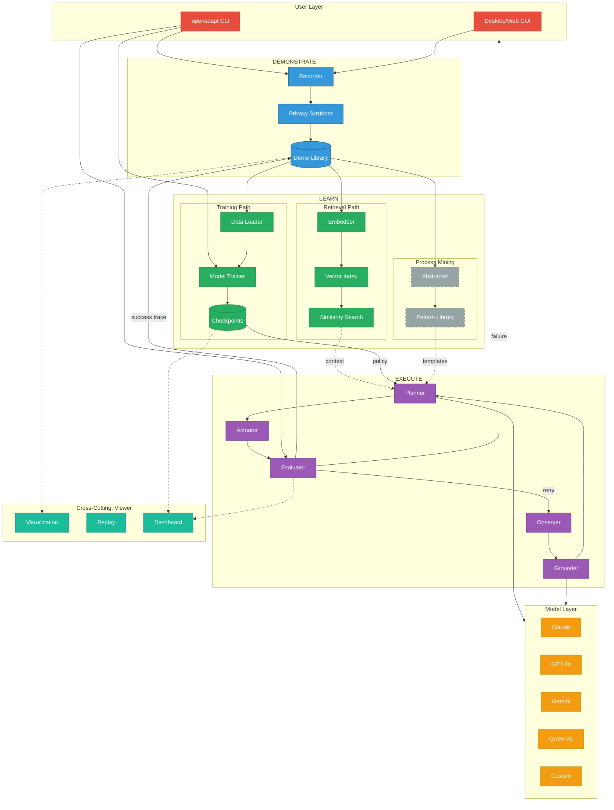
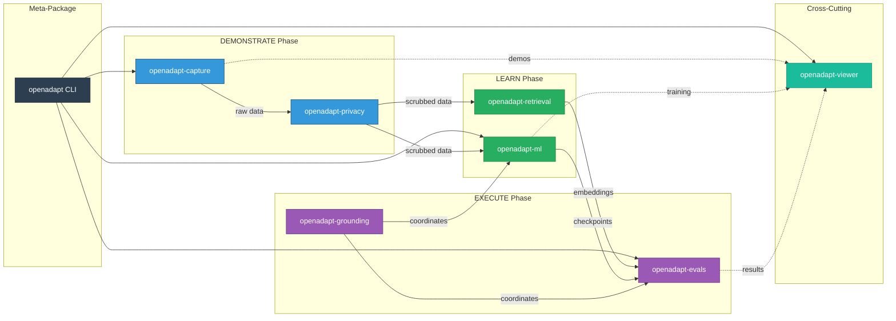
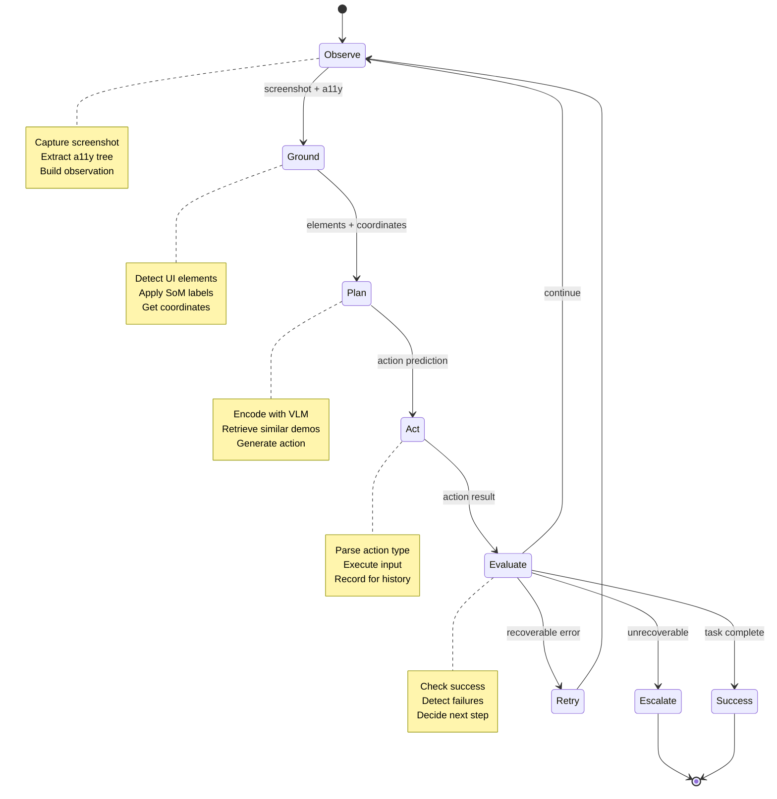
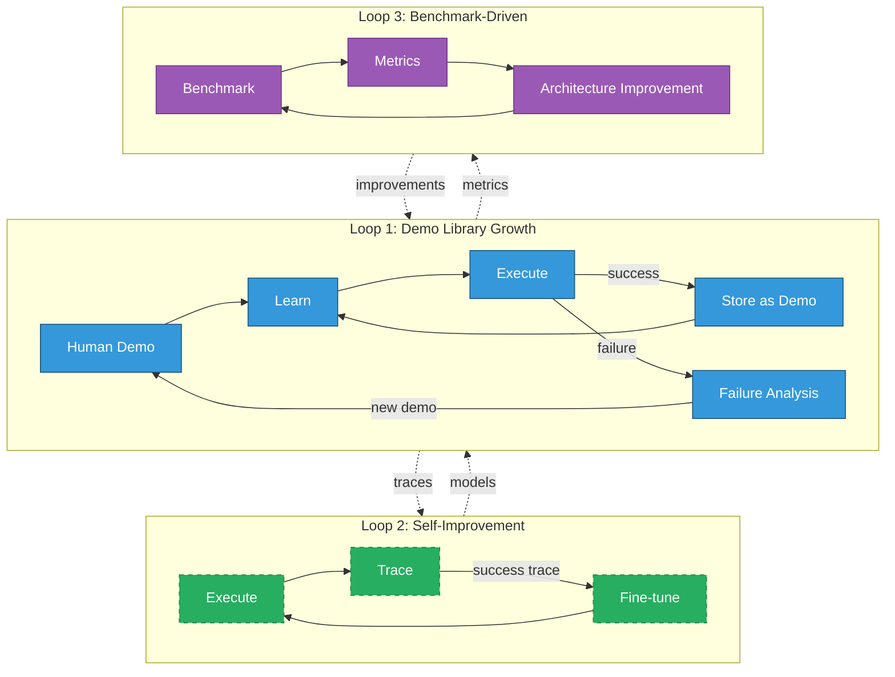

# OpenAdapt Architecture Evolution

**Version**: 2.0
**Date**: January 2026
**Status**: Living Document

---

## Executive Summary

This document synthesizes OpenAdapt's original alpha vision with modern GUI agent state-of-the-art (SOTA) research. It defines the architectural principles, implementation status, and roadmap for OpenAdapt as the leading open-source demonstration-conditioned GUI automation framework.

---

## Table of Contents

1. [Core Insight: Demonstration-Conditioned Automation](#1-core-insight-demonstration-conditioned-automation)
2. [The Abstraction Ladder](#2-the-abstraction-ladder)
3. [Three-Phase Architecture](#3-three-phase-architecture)
4. [Package Responsibilities](#4-package-responsibilities)
5. [Feedback Loops](#5-feedback-loops)
6. [Model Layer](#6-model-layer)
7. [Implementation Status](#7-implementation-status)
8. [Architecture Diagrams](#8-architecture-diagrams)
9. [Key Design Principles](#9-key-design-principles)
10. [Research Alignment](#10-research-alignment)
11. [Future Directions](#11-future-directions)

---

## 1. Core Insight: Demonstration-Conditioned Automation

### The Fundamental Differentiator

OpenAdapt's fundamental differentiator is **demonstration-conditioned automation**: "show, don't tell."

| Approach | Description | Example |
|----------|-------------|---------|
| **Prompt-Driven** (Traditional) | User describes what to do in natural language | "Book a flight from NYC to LA for next Tuesday" |
| **Demo-Conditioned** (OpenAdapt) | Agent learns from watching user perform the task | Record user booking a flight, replay with new parameters |

### Why This Matters

1. **Reduced Ambiguity**: Demonstrations capture implicit knowledge that's hard to verbalize
2. **Grounded in Reality**: Agents learn from actual UI interactions, not abstract descriptions
3. **Lower Barrier to Entry**: Users don't need prompt engineering skills
4. **Validated Improvement**: 33% to 100% first-action accuracy with demo conditioning (internal benchmarks)

### The "Show, Don't Tell" Principle

```
Traditional Agent:
  User: "Click the submit button"
  Agent: [Which submit button? What context? What state?]

Demo-Conditioned Agent:
  User: [Records clicking the blue "Submit Order" button after filling form]
  Agent: [Learns the full context: form state, button appearance, preceding actions]
```

---

## 2. The Abstraction Ladder

OpenAdapt processes demonstrations through progressive abstraction levels, enabling generalization, transfer learning, and explainability.

### Abstraction Levels

```
Level 0 - LITERAL (Raw Events)
    { press: "h", press: "i", press: " ", press: "b", press: "o", press: "b" }

         | Reduction (aggregate consecutive events)
         v

Level 1 - SYMBOLIC (Semantic Actions)
    { type: "hi bob" }

         | Anonymization (extract parameters)
         v

Level 2 - TEMPLATE (Parameterized Actions)
    { type: "hi <firstname>" }

         | Process Mining (discover patterns)
         v

Level 3 - SEMANTIC (Intent Recognition)
    { greet: user }

         | Goal Composition (high-level planning)
         v

Level 4 - GOAL (Task Specification)
    "Say hello to the customer"
```

### Abstraction Benefits

| Level | Enables | Example Use Case |
|-------|---------|------------------|
| Literal | Exact replay | Debugging, audit trails |
| Symbolic | Human-readable logs | Training data visualization |
| Template | Parameterized replay | Same task, different data |
| Semantic | Cross-application transfer | Greeting in any messaging app |
| Goal | Natural language control | "Greet the next customer" |

### Current Implementation Status

- **Literal to Symbolic**: Implemented in `openadapt-capture` (event aggregation)
- **Symbolic to Template**: Partially implemented (regex-based extraction)
- **Template to Semantic**: Research stage (LLM-based intent recognition)
- **Semantic to Goal**: Future work (requires process mining)

---

## 3. Three-Phase Architecture

OpenAdapt operates in three distinct phases, each with dedicated packages and responsibilities.

### Phase Overview

```
+------------------+     +------------------+     +------------------+
|                  |     |                  |     |                  |
|    DEMONSTRATE   | --> |      LEARN       | --> |     EXECUTE      |
|                  |     |                  |     |                  |
|  (Observation    |     |  (Policy         |     |  (Agent          |
|   Collection)    |     |   Acquisition)   |     |   Deployment)    |
|                  |     |                  |     |                  |
+------------------+     +------------------+     +------------------+
```

---

### Phase 1: DEMONSTRATE (Observation Collection)

**Purpose**: Capture rich trajectories from human demonstrations.

**Inputs**:
- User performs task in target application
- Optional: Task description, success criteria, audio narration

**Outputs**:
- Screenshot sequences (PNG/JPEG)
- Input events (mouse, keyboard, touch)
- Accessibility tree snapshots (a11y)
- Window metadata (title, bounds, process)
- Audio transcription (optional)

**Privacy Integration**:
- Optional PII/PHI scrubbing before storage
- Configurable redaction levels

**Storage Format**:
- JSON for metadata and events
- Parquet for efficient batch access
- PNG/JPEG for screenshots

**Packages**: `openadapt-capture`, `openadapt-privacy`

---

### Phase 2: LEARN (Policy Acquisition)

**Purpose**: Transform demonstrations into executable agent policies.

**Three Learning Paths**:

#### Path A: Retrieval-Augmented Prompting
- Index demonstrations in vector database
- At inference, retrieve similar demos as context
- Condition API agent (Claude, GPT, Gemini) on retrieved examples
- **Advantage**: Works with any VLM, no training required
- **Package**: `openadapt-retrieval`

#### Path B: Fine-Tuning
- Train/fine-tune VLM on demonstration dataset
- Use LoRA for parameter-efficient training
- Deploy locally or via inference API
- **Advantage**: Specialized performance, privacy, lower inference cost
- **Package**: `openadapt-ml`

#### Path C: Process Mining
- Extract reusable action patterns across demonstrations
- Build abstraction hierarchy (template, semantic, goal)
- Enable cross-task transfer learning
- **Status**: Research/Future
- **Package**: `openadapt-ml` (future)

**Outputs**:
- Vector embeddings for retrieval
- Model checkpoints for fine-tuned models
- Process graphs for abstraction (future)

---

### Phase 3: EXECUTE (Agent Deployment)

**Purpose**: Run trained/conditioned agents to perform tasks autonomously.

**Execution Loop**:

```
while not task_complete:
    1. OBSERVE
       - Capture current screenshot
       - Extract accessibility tree
       - Build observation state

    2. GROUND
       - Localize UI elements (bounding boxes)
       - Apply Set-of-Mark (SoM) annotation
       - Map elements to coordinates or IDs

    3. PLAN
       - Encode observation with VLM
       - Condition on goal + history + retrieved demos
       - Generate action prediction

    4. ACT
       - Parse action (click, type, scroll, etc.)
       - Execute via input synthesis
       - Record action for history

    5. EVALUATE
       - Check for success indicators
       - Detect failure patterns
       - Decide: continue, retry, or escalate
```

**Grounding Modes**:

| Mode | Description | Accuracy | Use Case |
|------|-------------|----------|----------|
| **Direct** | VLM predicts raw (x, y) coordinates | Variable | Simple, fast |
| **Set-of-Mark (SoM)** | UI elements labeled with IDs, VLM selects ID | High | Complex UIs |
| **Hybrid** | SoM for elements, Direct for fine positioning | Highest | Production |

**Packages**: `openadapt-grounding`, `openadapt-evals`, `openadapt-ml`

---

## 4. Package Responsibilities

### Core Packages

| Package | Phase | Responsibility | Key Exports |
|---------|-------|----------------|-------------|
| `openadapt-capture` | DEMONSTRATE | GUI recording, event capture, storage | `Recorder`, `CaptureSession`, `Action`, `Screenshot` |
| `openadapt-ml` | LEARN | Model training, inference, adapters | `Trainer`, `AgentPolicy`, `VLMAdapter` |
| `openadapt-evals` | EXECUTE | Benchmark evaluation, metrics | `BenchmarkAdapter`, `ApiAgent`, `evaluate_agent` |
| `openadapt-viewer` | Cross-cutting | HTML visualization, replay | `PageBuilder`, `HTMLBuilder`, `TrajectoryViewer` |

### Optional Packages

| Package | Phase | Responsibility | Key Exports |
|---------|-------|----------------|-------------|
| `openadapt-grounding` | EXECUTE | UI element localization | `OmniParser`, `Florence2`, `GeminiGrounder` |
| `openadapt-retrieval` | LEARN | Multimodal demo search | `DemoRetriever`, `VectorIndex`, `Embedder` |
| `openadapt-privacy` | DEMONSTRATE | PII/PHI scrubbing | `Scrubber`, `Redactor`, `PrivacyFilter` |

### Package Dependency Matrix

```
                    capture  ml  evals  viewer  grounding  retrieval  privacy
openadapt-capture      -     -    -       -        -          -          O
openadapt-ml           R     -    -       -        O          O          -
openadapt-evals        -     R    -       O        O          O          -
openadapt-viewer       O     O    O       -        -          -          O
openadapt-grounding    -     -    -       -        -          -          -
openadapt-retrieval    R     -    -       -        -          -          -
openadapt-privacy      -     -    -       -        -          -          -

Legend: R = Required, O = Optional, - = None
```

---

## 5. Feedback Loops

OpenAdapt implements continuous improvement through three feedback loops.

### System Diagram

```
                          DEMONSTRATE
                               |
                               | Human demonstrations
                               v
+--------------------------> LEARN <--------------------------+
|                              |                               |
|                              | Trained policies              |
|   +--------------------------|---------------------+         |
|   |                          v                     |         |
|   |   +----------------> EXECUTE <--------------+  |         |
|   |   |                      |                  |  |         |
|   |   | Retry on             | Success/Failure  |  |         |
|   |   | recoverable          | outcomes         |  |         |
|   |   | errors               v                  |  |         |
|   |   |              +-------+-------+          |  |         |
|   |   |              |               |          |  |         |
|   |   +--------------+   EVALUATE    +----------+  |         |
|   |                  |               |             |         |
|   |                  +-------+-------+             |         |
|   |                          |                     |         |
|   |                          | Execution traces    |         |
|   |                          v                     |         |
|   |                  Demo library grows            |         |
|   |                          |                     |         |
|   +--------------------------+                     |         |
|                                                    |         |
|   Failure analysis identifies gaps                 |         |
|                    |                               |         |
|                    v                               |         |
|           New demonstrations                       |         |
|                    |                               |         |
+--------------------+                               |         |
                                                     |         |
                     Self-improvement loop           |         |
                     (execution traces -> training)  |         |
                              |                      |         |
                              +----------------------+         |
                                                               |
             Benchmark-driven development                      |
             (eval results -> architecture improvements)       |
                              |                                |
                              +--------------------------------+
```

### Loop Details

#### Loop 1: Demonstration Library Growth
- Successful executions are stored as new demonstrations
- Failed executions trigger gap analysis
- Human reviews and corrects failures
- Corrections become new training data

#### Loop 2: Self-Improvement (Future)
- Agent traces its own execution
- Successful traces fine-tune the policy
- Automatic curriculum: easy to hard tasks
- Reduces need for human demonstrations over time

#### Loop 3: Benchmark-Driven Development
- Regular evaluation on standard benchmarks
- Failure modes inform architecture changes
- New capabilities tested before merge
- Regression detection prevents quality drops

---

## 6. Model Layer

OpenAdapt is model-agnostic, supporting multiple foundation models through a unified adapter interface.

### Supported Models

#### API Providers (Cloud)

| Provider | Model | Status | Best For |
|----------|-------|--------|----------|
| Anthropic | Claude 3.5 Sonnet | Implemented | General GUI tasks |
| OpenAI | GPT-4o | Implemented | Complex reasoning |
| Google | Gemini 2.0 Flash | Implemented | Cost-efficient |

#### Local Models (Self-Hosted)

| Model | Parameters | Status | Best For |
|-------|------------|--------|----------|
| Qwen2-VL | 2B-72B | Implemented | Fine-tuning, privacy |
| Qwen2.5-VL | 3B-72B | Planned | Next-gen local |
| Molmo | 7B | Research | Efficiency |

### Adapter Interface

```python
class VLMAdapter(Protocol):
    """Protocol for VLM model adapters."""

    def predict(
        self,
        screenshot: Image,
        task: str,
        history: list[Action],
        context: Optional[list[Demo]] = None,
    ) -> Action:
        """Predict next action given observation."""
        ...

    def get_grounding(
        self,
        screenshot: Image,
        element_description: str,
    ) -> BoundingBox:
        """Ground element description to coordinates."""
        ...
```

### Prompt Architecture

OpenAdapt uses a structured prompting approach combining SOTA patterns:

```
SYSTEM: {role_definition}

CONTEXT:
- Retrieved demonstrations (if available)
- Task description
- Success criteria

OBSERVATION:
- Current screenshot (base64 or URL)
- Accessibility tree (structured)
- Element annotations (Set-of-Mark)

HISTORY:
- Previous N actions and their outcomes
- Current step number

INSTRUCTION:
- Action space definition
- Output format specification

USER: What action should be taken next?
```

---

## 7. Implementation Status

### Status Legend

| Symbol | Meaning |
|--------|---------|
| Solid | Implemented and tested |
| Dashed | In progress or partial |
| Dotted | Planned/Future |

### Component Status Matrix

```
+----------------------+------------------+------------------+
| Component            | Status           | Package          |
+----------------------+------------------+------------------+
| DEMONSTRATE PHASE                                          |
+----------------------+------------------+------------------+
| Screen capture       | Solid            | capture          |
| Event recording      | Solid            | capture          |
| A11y tree capture    | Solid            | capture          |
| Audio transcription  | Dashed           | capture          |
| Privacy scrubbing    | Solid            | privacy          |
| Demo library storage | Solid            | capture          |
+----------------------+------------------+------------------+
| LEARN PHASE                                                |
+----------------------+------------------+------------------+
| Demo embedding       | Solid            | retrieval        |
| Vector indexing      | Solid            | retrieval        |
| Similarity search    | Solid            | retrieval        |
| API model adapters   | Solid            | ml               |
| Training pipeline    | Dashed           | ml               |
| LoRA fine-tuning     | Dashed           | ml               |
| Process mining       | Dotted           | ml (future)      |
+----------------------+------------------+------------------+
| EXECUTE PHASE                                              |
+----------------------+------------------+------------------+
| Action execution     | Solid            | capture          |
| Direct grounding     | Solid            | grounding        |
| SoM grounding        | Solid            | grounding        |
| OmniParser provider  | Solid            | grounding        |
| Florence2 provider   | Solid            | grounding        |
| Gemini grounding     | Solid            | grounding        |
| WAA benchmark        | Solid            | evals            |
| WebArena benchmark   | Dashed           | evals            |
| OSWorld benchmark    | Dotted           | evals            |
| Mock benchmark       | Solid            | evals            |
+----------------------+------------------+------------------+
| CROSS-CUTTING                                              |
+----------------------+------------------+------------------+
| Viewer HTML output   | Solid            | viewer           |
| Trajectory replay    | Solid            | viewer           |
| Training dashboard   | Dashed           | viewer           |
| Benchmark viewer     | Dashed           | viewer           |
| Telemetry            | Dotted           | telemetry (new)  |
+----------------------+------------------+------------------+
```

### Priority Roadmap

#### P0 - This Week
- [x] Capture package with Recorder
- [x] Retrieval with embedding and search
- [x] Evals with WAA benchmark + mock
- [x] Grounding providers (OmniParser, Florence, Gemini)
- [x] Viewer component library
- [x] API baselines (Claude, GPT, Gemini)
- [ ] PyPI releases for all packages
- [ ] WAA baseline metrics

#### P1 - Next 2 Weeks
- [ ] Fine-tuning pipeline validation
- [ ] Demo conditioning integration in evals
- [ ] Multi-track evaluation (Direct, ReAct, SoM)
- [ ] docs.openadapt.ai launch

#### P2 - This Month
- [ ] Training dashboard in viewer
- [ ] WebArena benchmark integration
- [ ] Cloud GPU training (Lambda Labs)
- [ ] v1.0.0 meta-package release

#### P3 - Future
- [ ] Process mining / abstraction
- [ ] Self-improvement from execution traces
- [ ] Multi-agent collaboration
- [ ] Active learning with human feedback
- [ ] OSWorld benchmark integration

---

## 8. Architecture Diagrams

### Master Architecture Diagram (Evolved)

This diagram synthesizes the three-phase pipeline with all key concepts: demo-conditioned prompting, policy/grounding separation, safety gate, multi-source data ingestion, the abstraction ladder, and evaluation-driven feedback loops.

```mermaid
flowchart TB
    %% ═══════════════════════════════════════════════════════════════════════
    %% USER LAYER
    %% ═══════════════════════════════════════════════════════════════════════
    subgraph UserLayer["User Layer"]
        CLI["openadapt CLI"]
        UI["Desktop/Web GUI"]
    end

    %% ═══════════════════════════════════════════════════════════════════════
    %% MULTI-SOURCE DATA INGESTION
    %% ═══════════════════════════════════════════════════════════════════════
    subgraph DataSources["Multi-Source Data Ingestion"]
        direction LR
        HUMAN["Human<br/>Demonstrations"]
        SYNTH["Synthetic<br/>Data"]:::future
        BENCH_DATA["Benchmark<br/>Tasks"]
        EXTERNAL["External<br/>Datasets"]:::future
    end

    %% ═══════════════════════════════════════════════════════════════════════
    %% PHASE 1: DEMONSTRATE (Observation Collection)
    %% ═══════════════════════════════════════════════════════════════════════
    subgraph Phase1["DEMONSTRATE (Observation Collection)"]
        direction TB

        subgraph CaptureLayer["Capture"]
            REC["Recorder<br/>openadapt-capture"]
            A11Y["A11y Tree"]
            SCREENSHOT["Screenshots"]
            EVENTS["Input Events"]

            REC --> A11Y
            REC --> SCREENSHOT
            REC --> EVENTS
        end

        subgraph PrivacyLayer["Privacy"]
            SCRUB["Scrubber<br/>openadapt-privacy"]
            REDACT["PII/PHI Redaction"]
            SCRUB --> REDACT
        end

        STORE[("Demo Library<br/>(JSON/Parquet)")]

        A11Y --> SCRUB
        SCREENSHOT --> SCRUB
        EVENTS --> SCRUB
        REDACT --> STORE
    end

    %% ═══════════════════════════════════════════════════════════════════════
    %% PHASE 2: LEARN (Policy Acquisition)
    %% ═══════════════════════════════════════════════════════════════════════
    subgraph Phase2["LEARN (Policy Acquisition)"]
        direction TB

        subgraph RetrievalPath["Path A: Retrieval-Augmented Prompting"]
            EMB["Embedder<br/>openadapt-retrieval"]
            IDX[("Vector Index")]
            SEARCH["Similarity Search"]

            EMB --> IDX
            IDX --> SEARCH
        end

        subgraph TrainingPath["Path B: Fine-Tuning"]
            LOADER["Data Loader"]
            TRAINER["Model Trainer<br/>openadapt-ml"]
            LORA["LoRA Adapters"]
            CKPT[("Model Checkpoints")]

            LOADER --> TRAINER
            TRAINER --> LORA
            LORA --> CKPT
        end

        subgraph MiningPath["Path C: Process Mining"]:::futureBlock
            ABSTRACT["Abstractor"]:::future
            PATTERNS["Pattern Library"]:::future

            ABSTRACT --> PATTERNS
        end
    end

    %% ═══════════════════════════════════════════════════════════════════════
    %% PHASE 3: EXECUTE (Agent Deployment)
    %% ═══════════════════════════════════════════════════════════════════════
    subgraph Phase3["EXECUTE (Agent Deployment)"]
        direction TB

        subgraph AgentLoop["Agent Execution Loop"]
            OBS["1. OBSERVE<br/>(Screenshot + A11y)"]
            GROUND["2. GROUND<br/>openadapt-grounding"]
            PLAN["3. PLAN<br/>(Demo-Conditioned Policy)"]
            ACT["4. ACT<br/>(Input Synthesis)"]

            OBS --> GROUND
            GROUND --> PLAN
            PLAN --> ACT
        end

        subgraph SafetyGate["Safety Gate (Runtime Layer)"]
            VALIDATE["Action Validation"]
            RISK["Risk Assessment"]
            CONFIRM["Human Confirm"]:::future

            VALIDATE --> RISK
            RISK --> CONFIRM
        end

        subgraph Evaluation["Evaluation"]
            EVALS["Benchmark Runner<br/>openadapt-evals"]
            METRICS["Metrics<br/>(Success, Steps, Time)"]
            COMPARE["Model Comparison"]

            EVALS --> METRICS
            METRICS --> COMPARE
        end

        ACT --> VALIDATE
        CONFIRM --> EVALS
    end

    %% ═══════════════════════════════════════════════════════════════════════
    %% THE ABSTRACTION LADDER
    %% ═══════════════════════════════════════════════════════════════════════
    subgraph AbstractionLadder["The Abstraction Ladder"]
        direction TB
        L0["Level 0: LITERAL<br/>(Raw Events)<br/>{ press: 'h', press: 'i' }"]
        L1["Level 1: SYMBOLIC<br/>(Semantic Actions)<br/>{ type: 'hi bob' }"]
        L2["Level 2: TEMPLATE<br/>(Parameterized)<br/>{ type: 'hi &lt;name&gt;' }"]
        L3["Level 3: SEMANTIC<br/>(Intent Recognition)<br/>{ greet: user }"]:::future
        L4["Level 4: GOAL<br/>(Task Specification)<br/>'Greet customer'"]:::future

        L0 -->|"Reduction"| L1
        L1 -->|"Anonymization"| L2
        L2 -.->|"Process Mining"| L3
        L3 -.->|"Goal Composition"| L4
    end

    %% ═══════════════════════════════════════════════════════════════════════
    %% MODEL LAYER (VLM Adapters)
    %% ═══════════════════════════════════════════════════════════════════════
    subgraph Models["Model Layer (VLM Adapters)"]
        direction LR

        subgraph CloudModels["Cloud APIs"]
            CLAUDE["Claude 3.5"]
            GPT["GPT-4o"]
            GEMINI["Gemini 2.0"]
        end

        subgraph LocalModels["Local Models"]
            QWEN["Qwen2-VL"]
            CUSTOM["Custom Fine-tuned"]
        end
    end

    %% ═══════════════════════════════════════════════════════════════════════
    %% VIEWER (Cross-Cutting)
    %% ═══════════════════════════════════════════════════════════════════════
    subgraph Viewer["Cross-Cutting: Viewer"]
        VIZ["Trajectory<br/>Visualization"]
        REPLAY["Demo<br/>Replay"]
        DASH["Training<br/>Dashboard"]:::partialImpl
    end

    %% ═══════════════════════════════════════════════════════════════════════
    %% DATA FLOW CONNECTIONS
    %% ═══════════════════════════════════════════════════════════════════════

    %% User interactions
    CLI --> REC
    UI --> REC
    CLI --> TRAINER
    CLI --> EVALS

    %% Multi-source ingestion
    HUMAN --> REC
    SYNTH -.-> LOADER
    BENCH_DATA --> EVALS
    EXTERNAL -.-> LOADER

    %% Demo flow to learning
    STORE --> EMB
    STORE --> LOADER
    STORE -.-> ABSTRACT

    %% ═══════════════════════════════════════════════════════════════════════
    %% DEMO-CONDITIONED PROMPTING (Core Innovation)
    %% Retrieval used in BOTH training AND evaluation
    %% ═══════════════════════════════════════════════════════════════════════
    SEARCH -->|"demo context<br/>(training)"| PLAN
    SEARCH -->|"demo context<br/>(evaluation)"| EVALS
    CKPT -->|"trained policy"| PLAN
    PATTERNS -.->|"templates"| PLAN

    %% Model connections (Policy/Grounding Separation)
    PLAN -->|"action prediction"| Models
    GROUND -->|"element localization"| Models

    %% ═══════════════════════════════════════════════════════════════════════
    %% EVALUATION-DRIVEN FEEDBACK LOOPS
    %% ═══════════════════════════════════════════════════════════════════════
    METRICS -->|"success traces<br/>(new demos)"| STORE
    METRICS -.->|"training signal<br/>(self-improvement)"| TRAINER
    COMPARE -->|"failure analysis"| UserLayer

    %% Viewer connections
    STORE -.-> VIZ
    STORE -.-> REPLAY
    CKPT -.-> DASH
    METRICS -.-> DASH

    %% ═══════════════════════════════════════════════════════════════════════
    %% STYLING
    %% ═══════════════════════════════════════════════════════════════════════

    %% Layer colors
    classDef userLayer fill:#E74C3C,stroke:#A93226,color:#fff
    classDef dataSource fill:#16A085,stroke:#0E6655,color:#fff
    classDef phase1 fill:#3498DB,stroke:#1A5276,color:#fff
    classDef phase2 fill:#27AE60,stroke:#1E8449,color:#fff
    classDef phase3 fill:#9B59B6,stroke:#6C3483,color:#fff
    classDef models fill:#F39C12,stroke:#B7950B,color:#fff
    classDef viewer fill:#1ABC9C,stroke:#148F77,color:#fff
    classDef safetyGate fill:#E74C3C,stroke:#922B21,color:#fff

    %% Implementation status
    classDef implemented fill:#2ECC71,stroke:#1E8449,color:#fff
    classDef partialImpl fill:#F4D03F,stroke:#B7950B,color:#000
    classDef future fill:#95A5A6,stroke:#707B7C,color:#fff,stroke-dasharray: 5 5
    classDef futureBlock fill:#EAECEE,stroke:#95A5A6,stroke-dasharray: 5 5

    %% Apply layer styles
    class CLI,UI userLayer
    class HUMAN,BENCH_DATA dataSource
    class REC,A11Y,SCREENSHOT,EVENTS,SCRUB,REDACT,STORE phase1
    class EMB,IDX,SEARCH,LOADER,TRAINER,LORA,CKPT phase2
    class OBS,GROUND,PLAN,ACT,VALIDATE,RISK,EVALS,METRICS,COMPARE phase3
    class CLAUDE,GPT,GEMINI,QWEN,CUSTOM models
    class VIZ,REPLAY viewer

    %% Apply abstraction ladder styles (implemented vs future)
    class L0,L1,L2 implemented
```

### Key Architectural Insights

#### 1. Demo-Conditioned Prompting (Core Innovation)

The diagram shows how **retrieval** feeds into BOTH:
- **Training path**: Similar demos condition the fine-tuning process
- **Evaluation path**: Retrieved demos provide in-context examples for API agents

This "show, don't tell" approach improves first-action accuracy from 33% to 100%.

#### 2. Policy/Grounding Separation

The EXECUTE phase clearly separates:
- **Policy** (PLAN): Decides *what* action to take (uses VLM reasoning)
- **Grounding**: Determines *where* to execute (UI element localization via SoM, OmniParser, etc.)

#### 3. Safety Gate as Runtime Layer

Before action execution, the Safety Gate provides:
- Action validation (sanity checks)
- Risk assessment (destructive action detection)
- Human confirmation (future: for high-risk actions)

#### 4. The Abstraction Ladder

Progressive generalization from raw events to goals:
- **Implemented**: Literal -> Symbolic -> Template
- **Future**: Semantic -> Goal (requires process mining)

#### 5. Evaluation-Driven Feedback Loops

Three feedback mechanisms:
1. **Demo Library Growth**: Success traces become new training data
2. **Self-Improvement**: Training signal from execution metrics (future)
3. **Failure Analysis**: Human review of failed executions

---

### Legacy Master Architecture Diagram

For reference, the previous architecture diagram:



### Package Responsibility Diagram



### Execution Loop Diagram



### Feedback Loop Diagram



---

## 9. Key Design Principles

### Principle 1: Model Agnostic

OpenAdapt works with any VLM that can process images and generate text.

**Implementation**:
- Adapter pattern for model integration
- Unified prompt format across providers
- Switchable at runtime via configuration

**Rationale**:
- Avoid vendor lock-in
- Enable cost optimization
- Future-proof against model evolution

### Principle 2: Demo-Conditioned

Agents learn from human examples, not just prompts.

**Implementation**:
- Retrieval-augmented prompting
- Fine-tuning on demonstration datasets
- Context windows include similar past examples

**Rationale**:
- Captures implicit knowledge
- Reduces ambiguity
- Enables transfer learning

### Principle 3: Abstraction-Aware

Progress from literal replay to semantic understanding.

**Implementation**:
- Abstraction ladder (literal -> symbolic -> template -> semantic -> goal)
- Incremental abstraction during processing
- Human-readable intermediate representations

**Rationale**:
- Enables generalization
- Supports explanation and debugging
- Allows cross-application transfer

### Principle 4: Evaluation-Driven

Rigorous benchmarking on standard tasks.

**Implementation**:
- WAA, WebArena, OSWorld benchmark integrations
- Automated regression detection
- Public leaderboard metrics

**Rationale**:
- Objective progress measurement
- Community comparability
- Quality assurance

### Principle 5: Privacy-First

Optional PII/PHI scrubbing at every stage.

**Implementation**:
- `openadapt-privacy` package
- Configurable scrubbing levels
- Local-only deployment option

**Rationale**:
- Enterprise compliance (HIPAA, GDPR)
- User trust
- Responsible AI

### Principle 6: Open Source

MIT license, community-driven development.

**Implementation**:
- All packages on GitHub
- Public roadmap and issues
- Contribution guidelines

**Rationale**:
- Transparency
- Community innovation
- No vendor lock-in

---

## 10. Research Alignment

OpenAdapt's architecture aligns with and builds upon recent GUI agent research.

### Key Research Papers

| Paper | Contribution | OpenAdapt Integration |
|-------|--------------|----------------------|
| Claude Computer Use (Anthropic, 2024) | Production VLM agent API | API adapter in `openadapt-ml` |
| UFO (Microsoft, 2024) | Windows agent architecture | Prompt patterns adopted |
| OSWorld (CMU, 2024) | Cross-platform benchmark | Benchmark adapter planned |
| Set-of-Mark (Microsoft, 2023) | Visual grounding via labels | Core grounding mode |
| OmniParser (Microsoft, 2024) | Pure-vision UI parsing | Provider in `openadapt-grounding` |
| WebArena (CMU, 2023) | Web automation benchmark | Benchmark adapter implemented |
| Mind2Web (OSU, 2023) | Web action prediction | Dataset format compatible |

### Research Contributions

OpenAdapt contributes to the research community through:

1. **Open Benchmark Infrastructure**: Standardized evaluation setup
2. **Demonstration Dataset Format**: Interoperable trajectory format
3. **Retrieval-Augmented Agents**: Demo conditioning research
4. **Grounding Comparison**: Multi-provider benchmarks
5. **Abstraction Research**: Process mining for GUI agents

---

## 11. Future Directions

### Near-Term (Q1 2026)

- Complete fine-tuning pipeline validation
- Achieve competitive WAA benchmark scores
- Launch docs.openadapt.ai
- Release v1.0.0 meta-package

### Medium-Term (2026)

- Process mining implementation
- Self-improvement loop activation
- Multi-benchmark evaluation suite
- Enterprise deployment guides

### Long-Term (2026+)

- Multi-agent collaboration
- Active learning with human feedback
- Mobile platform support
- Cross-platform transfer learning

### Research Agenda

1. **Abstraction Hierarchy**: Can we automatically extract semantic actions from demonstrations?
2. **Transfer Learning**: How do demos from one app help in another?
3. **Active Learning**: When should the agent ask for human help?
4. **Explanation**: How do we make agent decisions interpretable?

---

## Appendix A: Glossary

| Term | Definition |
|------|------------|
| **A11y Tree** | Accessibility tree - structured representation of UI elements |
| **Demo** | Recorded human demonstration (trajectory) |
| **Grounding** | Mapping text descriptions to UI coordinates |
| **LoRA** | Low-Rank Adaptation - efficient fine-tuning method |
| **SoM** | Set-of-Mark - visual grounding via element labels |
| **Trajectory** | Sequence of observations and actions |
| **VLM** | Vision-Language Model |
| **WAA** | Windows Agent Arena benchmark |

## Appendix B: Related Documents

- [Architecture Overview](./architecture.md) - Package structure and data flow
- [Roadmap Priorities](./roadmap-priorities.md) - Current development priorities
- [Telemetry Design](./design/telemetry-design.md) - Telemetry implementation
- [Landing Page Strategy](./design/landing-page-strategy.md) - Messaging and positioning

## Appendix C: Version History

| Version | Date | Changes |
|---------|------|---------|
| 2.0 | Jan 2026 | Comprehensive redesign, SOTA alignment |
| 1.0 | Dec 2025 | Initial modular architecture |
| 0.x | 2023-2024 | Legacy monolithic design |

---

*This document is maintained as part of the OpenAdapt project. For updates, see the [GitHub repository](https://github.com/OpenAdaptAI/OpenAdapt).*
