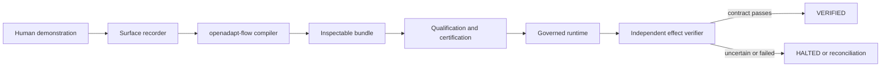

# OpenAdapt architecture

> **Canonical architecture.** See
> [docs.openadapt.ai/concepts](https://docs.openadapt.ai/concepts/) for the
> maintained design and trust-boundary documentation.

OpenAdapt is a governed demonstration compiler. A human demonstrates a task.
The engine retains evidence, compiles a deterministic program, qualifies it
against a policy, and runs it through a fail-closed runtime.

```mermaid
flowchart LR
    H[Human demonstration] --> R[Surface recorder]
    R --> C[openadapt-flow compiler]
    C --> B[Inspectable bundle]
    B --> Q[Qualification and certification]
    Q --> X[Governed runtime]
    X --> V[Independent effect verifier]
    V -->|contract passes| OK[VERIFIED]
    V -->|uncertain or failed| STOP[HALTED or reconciliation]
```

## Repository roles

| Component | Product role | Source availability |
| --- | --- | --- |
| `OpenAdapt` | Launcher, meta-package, unified CLI, and stable public entry point | MIT |
| `openadapt-flow` | Compiler, certification, replay, governed repair, and run reports | MIT |
| `openadapt-capture` | Native screen, mouse, keyboard, timing, window, and media capture | MIT |
| `openadapt-desktop` | Cross-platform authoring and operator cockpit | MIT |
| `openadapt-privacy` | Local sanitization and review mechanisms | MIT |
| OpenAdapt Cloud | Managed control plane, identity, billing, fleet coordination, and hosted execution | Proprietary |

The launcher installs Flow in its base dependency set. Capability extras select
the surface-specific dependencies. The launcher does not implement a second
compiler or runtime.

## Recording paths

The browser recorder uses Playwright. DOM identity, field geometry, and
source-time secret exclusion are required on this path.

Native and remote demonstrations use `openadapt-capture` for screen, input,
timing, window scope, and media. Optional UIA, Accessibility, or AT-SPI
observers add structural evidence on the local desktop. RDP and Citrix remain
external pixel surfaces.

All paths normalize into the recording contract that Flow compiles.

## Healthy execution

A healthy run uses the compiled program and retained evidence. It makes no
generative-model call. The runtime resolves targets through the strongest
available deterministic evidence. It checks the live state before an action
and the declared result after an action.

An optional model can propose a repair when policy permits it. The proposal is
not authorization. A repair remains a versioned candidate until review,
qualification, approval, and promotion complete.

## Result states

`VERIFIED` means that the complete configured production contract confirmed the
declared business effect. `COMPLETED_UNVERIFIED` is a Demo outcome. It is not a
production success. Uncertainty after possible delivery requires
reconciliation. The runtime does not retry a possibly dispatched effect
without proof.

## Data boundary

Raw recordings and live observations stay local by default. Compilation does
not make a recording safe to upload. A derivative crosses a boundary only
after local sanitization, complete inventory, review, exact-hash approval, and
destination policy checks.

## Production qualification

Production applies to exact admitted product and deployment releases and an
exact qualified workflow, not to a substrate name. The workflow admission binds
the organization and workflow identity; bundle version and digest; admitted
runtime release; application and environment; input, action, identity, effect,
and policy contracts; evidence authority; and its issue, expiry, and revocation
state. Qualification requires at least three trials for each task and condition.
A closed result schema must report silent incorrect success and over-halt. A
Production run gate must reject an absent, expired, revoked, or mismatched
product or workflow admission. The
[live signed Production record](https://docs.openadapt.ai/production-lifecycle.json)
is the maturity authority for public releases.

The former model-training architecture remains in Git history and optional
research packages. It is not the current product architecture.
