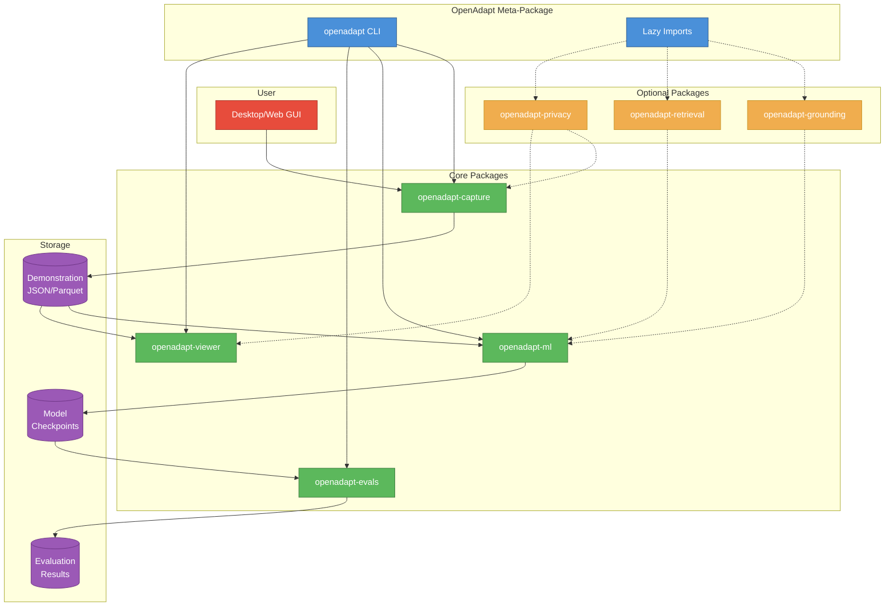
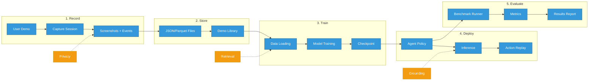
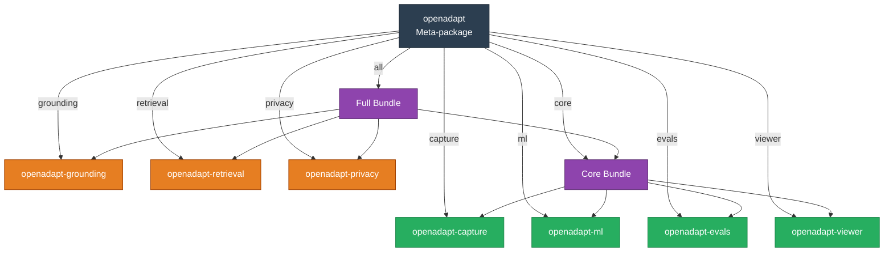
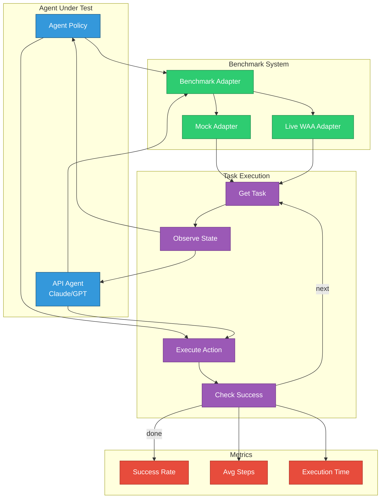
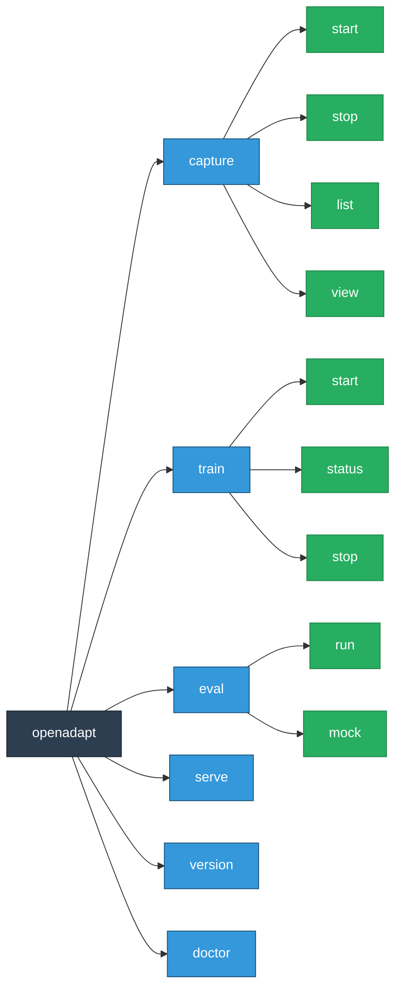

# OpenAdapt Architecture

OpenAdapt v1.0+ uses a **modular meta-package architecture** where the main `openadapt` package provides a unified CLI and depends on focused sub-packages.

## System Overview



## Data Flow Pipeline



## Package Dependencies



## Component Details

### Core Packages

| Package | Responsibility | Key Exports |
|---------|---------------|-------------|
| **openadapt-capture** | GUI recording, event capture, storage | `CaptureSession`, `Recorder`, `Action` |
| **openadapt-ml** | Model training, inference, adapters | `QwenVLAdapter`, `Trainer`, `AgentPolicy` |
| **openadapt-evals** | Benchmark evaluation, metrics | `ApiAgent`, `BenchmarkAdapter`, `evaluate_agent_on_benchmark` |
| **openadapt-viewer** | HTML visualization, replay viewer | `PageBuilder`, `HTMLBuilder` |

### Optional Packages

| Package | Responsibility | Use Case |
|---------|---------------|----------|
| **openadapt-grounding** | UI element localization | Improved click accuracy with element detection |
| **openadapt-retrieval** | Multimodal demo search | Find similar demonstrations for few-shot prompting |
| **openadapt-privacy** | PII/PHI scrubbing | Redact sensitive data before storage/training |

## Evaluation Loop



## CLI Command Structure



## Installation Options

```bash
# Minimal CLI only
pip install openadapt

# Individual packages
pip install openadapt[capture]     # GUI capture/recording
pip install openadapt[ml]          # ML training and inference
pip install openadapt[evals]       # Benchmark evaluation
pip install openadapt[viewer]      # HTML visualization

# Optional packages
pip install openadapt[grounding]   # UI element localization
pip install openadapt[retrieval]   # Demo search/retrieval
pip install openadapt[privacy]     # PII/PHI scrubbing

# Bundles
pip install openadapt[core]        # capture + ml + evals + viewer
pip install openadapt[all]         # Everything
```

---

*This architecture enables independent development and versioning of each component while maintaining a unified CLI experience.*
