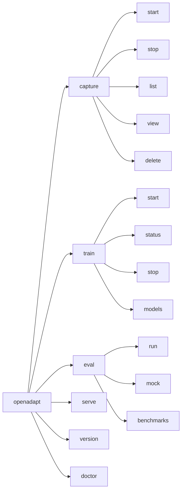

# CLI Reference

OpenAdapt provides a unified command-line interface for all functionality.

## Global Commands

### Version

Show installed package versions:

```bash
openadapt version
```

Output:

```
openadapt: 1.0.0
openadapt-capture: 1.0.0
openadapt-ml: 1.0.0
openadapt-evals: 1.0.0
openadapt-viewer: 1.0.0
```

### Doctor

Check system requirements and configuration:

```bash
openadapt doctor
```

This verifies:

- Python version
- Required packages
- System permissions (macOS)
- GPU availability
- Environment variables

---

## Capture Commands

Commands for collecting human demonstrations.

### capture start

Start a new demonstration collection session.

```bash
openadapt capture start --name <name> [options]
```

**Arguments:**

| Argument | Required | Description |
|----------|----------|-------------|
| `--name` | Yes | Name for the capture session |
| `--interval` | No | Screenshot interval in seconds (default: 0.1) |
| `--no-screenshots` | No | Disable screenshot capture |
| `--no-keyboard` | No | Disable keyboard event capture |

**Examples:**

```bash
# Basic demonstration collection
openadapt capture start --name login-task

# Demonstration collection without screenshots
openadapt capture start --name audio-task --no-screenshots

# Demonstration collection with slower screenshot interval
openadapt capture start --name slow-task --interval 1.0
```

### capture stop

Stop the current demonstration collection.

```bash
openadapt capture stop
```

Alternatively, press `Ctrl+C` in the capture terminal.

### capture list

List all captured demonstrations.

```bash
openadapt capture list
```

Output:

```
NAME           EVENTS   DURATION   DATE
login-task     45       2m 30s     2026-01-16
email-reply    23       1m 15s     2026-01-15
form-fill      89       5m 42s     2026-01-14
```

### capture view

Open the trajectory viewer for a demonstration.

```bash
openadapt capture view <name> [options]
```

**Arguments:**

| Argument | Required | Description |
|----------|----------|-------------|
| `<name>` | Yes | Name of the demonstration to view |
| `--port` | No | Server port (default: 8080) |
| `--no-browser` | No | Don't open browser automatically |

### capture delete

Delete a demonstration.

```bash
openadapt capture delete <name>
```

---

## Train Commands

Commands for policy learning from demonstrations.

### train start

Start policy learning from a demonstration.

```bash
openadapt train start --capture <name> --model <model> [options]
```

**Arguments:**

| Argument | Required | Description |
|----------|----------|-------------|
| `--capture` | Yes | Name of the demonstration to train on |
| `--model` | Yes | Model architecture |
| `--epochs` | No | Number of training epochs (default: 10) |
| `--batch-size` | No | Batch size (default: 4) |
| `--learning-rate` | No | Learning rate (default: 1e-4) |
| `--output` | No | Output directory (default: training_output/) |

**Available Models:**

- `qwen3vl-2b` - Qwen3-VL 2B parameters
- `qwen3vl-7b` - Qwen3-VL 7B parameters
- `llava-1.6-7b` - LLaVA 1.6 7B parameters

**Examples:**

```bash
# Basic policy learning
openadapt train start --capture login-task --model qwen3vl-2b

# Policy learning with custom parameters
openadapt train start \
    --capture login-task \
    --model qwen3vl-7b \
    --epochs 20 \
    --batch-size 2 \
    --learning-rate 5e-5
```

### train status

Check policy learning progress.

```bash
openadapt train status
```

Output:

```
Training: login-task
Model: qwen3vl-2b
Progress: Epoch 5/10 (50%)
Loss: 0.234
ETA: 15 minutes
```

### train stop

Stop the current policy learning.

```bash
openadapt train stop
```

### train models

List available model architectures.

```bash
openadapt train models
```

---

## Eval Commands

Commands for evaluating agents.

### eval run

Run an evaluation.

```bash
openadapt eval run [options]
```

**Arguments:**

| Argument | Required | Description |
|----------|----------|-------------|
| `--checkpoint` | No* | Path to model checkpoint |
| `--agent` | No* | Agent type (api-claude, api-gpt4v) |
| `--benchmark` | Yes | Benchmark name |
| `--tasks` | No | Number of tasks (default: all) |
| `--output` | No | Output directory for results |

*One of `--checkpoint` or `--agent` is required.

**Available Benchmarks:**

- `waa` - Windows Agent Arena
- `osworld` - OSWorld
- `webarena` - WebArena
- `mock` - Mock benchmark for testing

**Examples:**

```bash
# Evaluate a trained model
openadapt eval run --checkpoint training_output/model.pt --benchmark waa

# Evaluate Claude API agent
openadapt eval run --agent api-claude --benchmark waa

# Run subset of tasks
openadapt eval run --agent api-claude --benchmark waa --tasks 10
```

### eval mock

Run a mock evaluation to test setup.

```bash
openadapt eval mock --tasks <n>
```

**Arguments:**

| Argument | Required | Description |
|----------|----------|-------------|
| `--tasks` | No | Number of mock tasks (default: 10) |

### eval benchmarks

List available benchmarks.

```bash
openadapt eval benchmarks
```

---

## Serve Commands

Start the dashboard server.

```bash
openadapt serve [options]
```

**Arguments:**

| Argument | Required | Description |
|----------|----------|-------------|
| `--port` | No | Server port (default: 8080) |
| `--host` | No | Host address (default: localhost) |

Access the dashboard at `http://localhost:8080`.

---

## Command Structure



---

## Environment Variables

| Variable | Description |
|----------|-------------|
| `ANTHROPIC_API_KEY` | API key for Claude agent |
| `OPENAI_API_KEY` | API key for GPT-4V agent |
| `OPENADAPT_CAPTURES_DIR` | Directory for captures (default: ./captures) |
| `OPENADAPT_OUTPUT_DIR` | Directory for outputs (default: ./training_output) |

---

## Exit Codes

| Code | Description |
|------|-------------|
| 0 | Success |
| 1 | General error |
| 2 | Invalid arguments |
| 3 | Missing dependencies |
| 4 | Permission denied |
