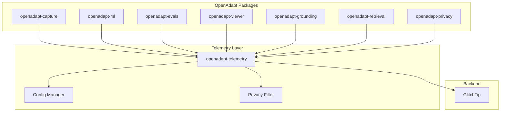

# Telemetry Design for OpenAdapt Packages

## Overview

This document outlines the design for adding optional telemetry to all OpenAdapt packages. The system is designed to be:

- **Opt-in by default** (or easily disabled)
- **Privacy-respecting** (no PII, no screenshots, minimal data)
- **Developer-aware** (internal usage tagged for filtering)
- **Unified** (shared module across all packages)

## Table of Contents

1. [Service Recommendation](#service-recommendation)
2. [Architecture](#architecture)
3. [Implementation Approach](#implementation-approach)
4. [Configuration Options](#configuration-options)
5. [Privacy Considerations](#privacy-considerations)
6. [Internal Usage Tagging](#internal-usage-tagging)
7. [Code Examples](#code-examples)
8. [Migration Plan](#migration-plan)
9. [References](#references)

---

## Service Recommendation

### Recommendation: GlitchTip (Self-Hosted) + Sentry SDK

After evaluating both options, we recommend **continuing with GlitchTip** (already in use in the legacy codebase) with the Sentry Python SDK.

### Comparison

| Feature | GlitchTip | Sentry |
|---------|-----------|--------|
| **Pricing** | Free (self-hosted) or $15/mo (100K errors) | Free tier limited, paid plans start higher |
| **Self-Hosting** | Simple (4 components: backend, workers, Redis, PostgreSQL) | Complex (12+ components including Kafka, Zookeeper, ClickHouse) |
| **Resource Requirements** | Minimal (1GB RAM, 1 CPU core) | Heavy (requires significant infrastructure) |
| **SDK Compatibility** | Uses Sentry SDK (drop-in compatible) | Native SDK |
| **Open Source** | Fully open source | Partially open source |
| **Features** | Error tracking, uptime monitoring, basic performance | Full APM, session replay, distributed tracing |
| **Privacy** | Self-hosted = full data control | Cloud = data sent to Sentry servers |

### Rationale

1. **Existing Integration**: The legacy OpenAdapt codebase already uses GlitchTip (DSN: `app.glitchtip.com`)
2. **Privacy-First**: Self-hosting ensures complete control over sensitive automation data
3. **Cost-Effective**: Free for self-hosted or very affordable cloud option
4. **SDK Compatibility**: Uses the battle-tested Sentry Python SDK
5. **Simplicity**: Easier to deploy and maintain than self-hosted Sentry
6. **Open Source Alignment**: Matches OpenAdapt's open-source philosophy

### GlitchTip Cloud vs Self-Hosted

| Option | Pros | Cons |
|--------|------|------|
| **Cloud (glitchtip.com)** | Zero maintenance, instant setup | Monthly cost, data leaves your infrastructure |
| **Self-Hosted** | Free, full data control, customizable | Requires server, maintenance overhead |

**Recommendation**: Start with GlitchTip Cloud for simplicity, migrate to self-hosted if needed.

---

## Architecture

### Shared Telemetry Module

We propose a new package `openadapt-telemetry` that provides a unified telemetry interface for all OpenAdapt packages.

```
openadapt-telemetry/
├── src/openadapt_telemetry/
│   ├── __init__.py           # Public API exports
│   ├── config.py             # Configuration management
│   ├── client.py             # Telemetry client (Sentry wrapper)
│   ├── events.py             # Event types and helpers
│   ├── privacy.py            # PII filtering and scrubbing
│   └── decorators.py         # Convenience decorators
└── pyproject.toml
```

### Package Integration



---

## Implementation Approach

### Option A: Shared Package (Recommended)

Create `openadapt-telemetry` as a dependency for all packages.

**Pros:**
- Single source of truth for telemetry logic
- Consistent behavior across all packages
- Easy to update and maintain
- Centralized privacy controls

**Cons:**
- Additional dependency
- Version coordination required

### Option B: Per-Package Implementation

Each package implements its own telemetry.

**Pros:**
- Package independence
- No cross-package dependencies

**Cons:**
- Code duplication
- Inconsistent implementations
- Harder to maintain privacy controls

### Decision: Option A (Shared Package)

The shared package approach aligns with the meta-package architecture and ensures consistency.

---

## Configuration Options

### Environment Variables

```bash
# Primary opt-out mechanism (industry standard)
OPENADAPT_TELEMETRY_ENABLED=false     # Disable all telemetry
DO_NOT_TRACK=1                         # Universal opt-out (alternative)

# Internal/developer mode
OPENADAPT_INTERNAL=true               # Tag as internal usage
OPENADAPT_DEV=true                    # Development mode (alternative)

# Configuration overrides
OPENADAPT_TELEMETRY_DSN=<dsn>         # Custom DSN
OPENADAPT_TELEMETRY_ENVIRONMENT=dev   # Environment name
OPENADAPT_TELEMETRY_SAMPLE_RATE=0.1   # Sampling rate (0.0-1.0)
```

### Configuration File

```json
// ~/.config/openadapt/telemetry.json
{
  "enabled": true,
  "internal": false,
  "dsn": null,
  "environment": "production",
  "sample_rate": 1.0,
  "error_tracking": true,
  "performance_tracking": false,
  "feature_usage": true
}
```

### Priority Order

1. Environment variables (highest priority)
2. Configuration file
3. Package defaults (lowest priority)

### Default Configuration

```python
DEFAULTS = {
    "enabled": True,                    # Enabled by default, easy opt-out
    "internal": False,                  # External user by default
    "dsn": "https://xxx@app.glitchtip.com/XXXX",
    "environment": "production",
    "sample_rate": 1.0,                 # 100% for errors
    "traces_sample_rate": 0.01,         # 1% for performance
    "error_tracking": True,
    "performance_tracking": True,
    "feature_usage": True,
    "send_default_pii": False,          # Never send PII by default
}
```

---

## Privacy Considerations

### What We Collect (Ethical Data)

| Category | Data Collected | Purpose |
|----------|---------------|---------|
| **Error Tracking** | Exception type, stack trace, error message | Bug fixing, stability monitoring |
| **Performance** | Function timing, memory usage | Optimization, bottleneck detection |
| **Feature Usage** | Feature names, operation counts | Prioritize development, understand needs |
| **Environment** | OS, Python version, package versions | Compatibility testing, support |
| **Session** | Anonymous session ID, duration | Usage patterns, engagement |

### What We Never Collect

| Category | Data NOT Collected | Reason |
|----------|-------------------|--------|
| **PII** | Names, emails, IP addresses | Privacy violation |
| **Screenshots** | Screen captures, images | Highly sensitive |
| **User Content** | Text typed, file contents | Privacy violation |
| **Credentials** | API keys, passwords, tokens | Security risk |
| **File Paths** | Full paths (especially with usernames) | PII leakage |
| **Network Data** | URLs, request bodies | Sensitive information |
| **Biometrics** | Mouse patterns, typing cadence | Privacy violation |

### PII Scrubbing

```python
# Automatically scrubbed from all events
PII_DENYLIST = [
    "password",
    "secret",
    "token",
    "api_key",
    "authorization",
    "cookie",
    "session",
    "email",
    "phone",
    "address",
    "ssn",
    "credit_card",
]

# Path sanitization
def sanitize_path(path: str) -> str:
    """Remove username from file paths."""
    # /Users/john/code/file.py -> /Users/<user>/code/file.py
    return re.sub(r'/Users/[^/]+/', '/Users/<user>/', path)
```

### GDPR Compliance

1. **Consent**: Telemetry is opt-in or easily disabled
2. **Data Minimization**: Collect only necessary data
3. **Purpose Limitation**: Use only for stated purposes
4. **Transparency**: Document what is collected
5. **Right to Erasure**: Provide way to request data deletion
6. **Data Protection**: Self-hosted option for full control

---

## Internal Usage Tagging

### Tagging Strategy

Internal OpenAdapt developers and testers should be tagged so their usage can be filtered out when analyzing real user behavior.

### Detection Methods

```python
def is_internal_user() -> bool:
    """Determine if current usage is from internal team."""

    # Method 1: Explicit environment variable
    if os.getenv("OPENADAPT_INTERNAL", "").lower() in ("true", "1", "yes"):
        return True

    # Method 2: Development environment
    if os.getenv("OPENADAPT_DEV", "").lower() in ("true", "1", "yes"):
        return True

    # Method 3: Not running from executable (dev mode)
    if not is_running_from_executable():
        return True

    # Method 4: Git repository present (development checkout)
    if Path(".git").exists():
        return True

    # Method 5: Known internal email domain (if user identified)
    # Note: Only if user voluntarily provided email

    # Method 6: CI/CD environment
    ci_env_vars = ["CI", "GITHUB_ACTIONS", "GITLAB_CI", "JENKINS_URL"]
    if any(os.getenv(var) for var in ci_env_vars):
        return True

    return False
```

### Tag Application

```python
def get_telemetry_tags() -> dict:
    """Get standard tags for all telemetry events."""
    return {
        "internal": is_internal_user(),
        "environment": get_environment(),
        "package_version": get_version(),
        "python_version": platform.python_version(),
        "os": platform.system(),
        "os_version": platform.release(),
    }
```

### Filtering in GlitchTip

```
# Filter out internal usage
tag:internal IS false

# View only internal usage
tag:internal IS true

# Combine with environment
tag:environment IS production AND tag:internal IS false
```

---

## Code Examples

### Package Installation

```toml
# pyproject.toml for any OpenAdapt package
[project]
dependencies = [
    "openadapt-telemetry>=0.1.0",
]

[project.optional-dependencies]
# Telemetry is optional for those who want zero tracking
minimal = []  # Install without telemetry
```

### Telemetry Client Implementation

```python
# src/openadapt_telemetry/client.py
"""Telemetry client for OpenAdapt packages."""

from __future__ import annotations

import os
import platform
from functools import lru_cache
from pathlib import Path
from typing import Any, Callable, Optional

import sentry_sdk
from sentry_sdk.types import Event, Hint


class TelemetryClient:
    """Unified telemetry client for all OpenAdapt packages."""

    _instance: Optional["TelemetryClient"] = None

    def __init__(self):
        self._initialized = False
        self._enabled = self._check_enabled()
        self._internal = self._check_internal()

    @classmethod
    def get_instance(cls) -> "TelemetryClient":
        """Get singleton instance."""
        if cls._instance is None:
            cls._instance = cls()
        return cls._instance

    def _check_enabled(self) -> bool:
        """Check if telemetry should be enabled."""
        # Universal opt-out
        if os.getenv("DO_NOT_TRACK", "").lower() in ("1", "true"):
            return False

        # Package-specific opt-out
        if os.getenv("OPENADAPT_TELEMETRY_ENABLED", "").lower() in ("false", "0", "no"):
            return False

        return True

    def _check_internal(self) -> bool:
        """Check if this is internal usage."""
        # Explicit flag
        if os.getenv("OPENADAPT_INTERNAL", "").lower() in ("true", "1", "yes"):
            return True

        # Development mode
        if os.getenv("OPENADAPT_DEV", "").lower() in ("true", "1", "yes"):
            return True

        # Git repo present (development checkout)
        if Path(".git").exists():
            return True

        # CI environment
        ci_vars = ["CI", "GITHUB_ACTIONS", "GITLAB_CI", "JENKINS_URL", "TRAVIS"]
        if any(os.getenv(var) for var in ci_vars):
            return True

        return False

    def initialize(
        self,
        dsn: Optional[str] = None,
        package_name: str = "openadapt",
        package_version: str = "unknown",
        **kwargs,
    ) -> None:
        """Initialize the telemetry client."""
        if not self._enabled:
            return

        if self._initialized:
            return

        dsn = dsn or os.getenv(
            "OPENADAPT_TELEMETRY_DSN",
            "https://xxx@app.glitchtip.com/XXXX"  # Default DSN
        )

        environment = os.getenv("OPENADAPT_TELEMETRY_ENVIRONMENT", "production")
        sample_rate = float(os.getenv("OPENADAPT_TELEMETRY_SAMPLE_RATE", "1.0"))
        traces_sample_rate = float(os.getenv("OPENADAPT_TELEMETRY_TRACES_SAMPLE_RATE", "0.01"))

        sentry_sdk.init(
            dsn=dsn,
            environment=environment,
            sample_rate=sample_rate,
            traces_sample_rate=traces_sample_rate,
            send_default_pii=False,
            before_send=self._before_send,
            before_send_transaction=self._before_send_transaction,
            **kwargs,
        )

        # Set default tags
        sentry_sdk.set_tag("internal", self._internal)
        sentry_sdk.set_tag("package", package_name)
        sentry_sdk.set_tag("package_version", package_version)
        sentry_sdk.set_tag("python_version", platform.python_version())
        sentry_sdk.set_tag("os", platform.system())
        sentry_sdk.set_tag("os_version", platform.release())

        self._initialized = True

    def _before_send(self, event: Event, hint: Hint) -> Optional[Event]:
        """Filter and sanitize events before sending."""
        # Scrub PII from stack traces
        if "exception" in event:
            self._scrub_exception(event["exception"])

        return event

    def _before_send_transaction(self, event: Event, hint: Hint) -> Optional[Event]:
        """Filter performance events."""
        return event

    def _scrub_exception(self, exception_data: dict) -> None:
        """Remove PII from exception data."""
        if "values" not in exception_data:
            return

        for value in exception_data["values"]:
            if "stacktrace" in value and "frames" in value["stacktrace"]:
                for frame in value["stacktrace"]["frames"]:
                    # Sanitize file paths
                    if "filename" in frame:
                        frame["filename"] = self._sanitize_path(frame["filename"])
                    if "abs_path" in frame:
                        frame["abs_path"] = self._sanitize_path(frame["abs_path"])

    @staticmethod
    def _sanitize_path(path: str) -> str:
        """Remove username from file paths."""
        import re
        # macOS/Linux: /Users/username/ or /home/username/
        path = re.sub(r'/Users/[^/]+/', '/Users/<user>/', path)
        path = re.sub(r'/home/[^/]+/', '/home/<user>/', path)
        # Windows: C:\Users\username\
        path = re.sub(r'C:\\Users\\[^\\]+\\', 'C:\\Users\\<user>\\', path)
        return path

    def capture_exception(self, exception: Optional[Exception] = None, **kwargs) -> None:
        """Capture an exception."""
        if not self._enabled:
            return
        sentry_sdk.capture_exception(exception, **kwargs)

    def capture_message(self, message: str, level: str = "info", **kwargs) -> None:
        """Capture a message."""
        if not self._enabled:
            return
        sentry_sdk.capture_message(message, level=level, **kwargs)

    def capture_event(self, event_name: str, properties: Optional[dict] = None) -> None:
        """Capture a custom event (feature usage)."""
        if not self._enabled:
            return

        properties = properties or {}
        properties["event_name"] = event_name
        sentry_sdk.capture_message(
            f"event:{event_name}",
            level="info",
            extras=properties,
        )

    def set_user(self, user_id: str, **kwargs) -> None:
        """Set user context (anonymous ID only)."""
        if not self._enabled:
            return
        sentry_sdk.set_user({"id": user_id, **kwargs})

    def set_tag(self, key: str, value: str) -> None:
        """Set a custom tag."""
        if not self._enabled:
            return
        sentry_sdk.set_tag(key, value)

    def add_breadcrumb(self, message: str, category: str = "default", **kwargs) -> None:
        """Add a breadcrumb for context."""
        if not self._enabled:
            return
        sentry_sdk.add_breadcrumb(message=message, category=category, **kwargs)


# Convenience singleton access
def get_telemetry() -> TelemetryClient:
    """Get the telemetry client instance."""
    return TelemetryClient.get_instance()
```

### Decorator for Function Tracking

```python
# src/openadapt_telemetry/decorators.py
"""Convenience decorators for telemetry."""

import functools
import time
from typing import Callable, Optional

import sentry_sdk

from .client import get_telemetry


def track_performance(name: Optional[str] = None):
    """Decorator to track function performance."""
    def decorator(func: Callable) -> Callable:
        operation_name = name or func.__name__

        @functools.wraps(func)
        def wrapper(*args, **kwargs):
            telemetry = get_telemetry()

            with sentry_sdk.start_transaction(op="function", name=operation_name):
                start = time.perf_counter()
                try:
                    return func(*args, **kwargs)
                finally:
                    duration = time.perf_counter() - start
                    sentry_sdk.set_measurement("duration_ms", duration * 1000)

        return wrapper
    return decorator


def track_errors(reraise: bool = True):
    """Decorator to automatically capture exceptions."""
    def decorator(func: Callable) -> Callable:
        @functools.wraps(func)
        def wrapper(*args, **kwargs):
            try:
                return func(*args, **kwargs)
            except Exception as e:
                get_telemetry().capture_exception(e)
                if reraise:
                    raise
        return wrapper
    return decorator


def track_feature(feature_name: str):
    """Decorator to track feature usage."""
    def decorator(func: Callable) -> Callable:
        @functools.wraps(func)
        def wrapper(*args, **kwargs):
            get_telemetry().capture_event(
                f"feature:{feature_name}",
                {"function": func.__name__},
            )
            return func(*args, **kwargs)
        return wrapper
    return decorator
```

### Package Integration Example

```python
# src/openadapt_retrieval/__init__.py
"""OpenAdapt Retrieval - Multimodal demo retrieval."""

from openadapt_retrieval.embeddings import (
    BaseEmbedder,
    CLIPEmbedder,
    Qwen3VLEmbedder,
    get_embedder,
)
from openadapt_retrieval.retriever import (
    DemoMetadata,
    MultimodalDemoRetriever,
    RetrievalResult,
    VectorIndex,
)
from openadapt_retrieval.storage import EmbeddingStorage

__version__ = "0.1.0"

# Initialize telemetry on import (lazy, respects opt-out)
try:
    from openadapt_telemetry import get_telemetry
    get_telemetry().initialize(
        package_name="openadapt-retrieval",
        package_version=__version__,
    )
except ImportError:
    # Telemetry package not installed (minimal install)
    pass

__all__ = [
    "BaseEmbedder",
    "Qwen3VLEmbedder",
    "CLIPEmbedder",
    "get_embedder",
    "MultimodalDemoRetriever",
    "VectorIndex",
    "RetrievalResult",
    "DemoMetadata",
    "EmbeddingStorage",
]
```

### Feature Usage Tracking Example

```python
# In openadapt-retrieval/retriever/demo_retriever.py

from openadapt_telemetry import get_telemetry, track_feature, track_performance


class MultimodalDemoRetriever:
    """Retriever for multimodal demo search."""

    @track_feature("retrieval.add_demo")
    def add_demo(
        self,
        demo_id: str,
        task: str,
        screenshot: Optional[Union[str, Path, Image.Image]] = None,
        **metadata,
    ) -> None:
        """Add a demo to the retrieval library."""
        # Implementation...

    @track_performance("retrieval.build_index")
    def build_index(self) -> None:
        """Build the FAISS index from stored demos."""
        try:
            # Implementation...
            get_telemetry().capture_event(
                "retrieval.index_built",
                {"num_demos": len(self._demos)},
            )
        except Exception as e:
            get_telemetry().capture_exception(e)
            raise

    @track_performance("retrieval.search")
    def retrieve(
        self,
        task: str,
        screenshot: Optional[Union[str, Path, Image.Image]] = None,
        top_k: int = 5,
    ) -> List[RetrievalResult]:
        """Find similar demos for a given query."""
        # Implementation...
```

### CLI Opt-Out Information

```python
# In CLI help text

TELEMETRY_HELP = """
OpenAdapt collects anonymous usage data to improve the software.

What we collect:
  - Error reports (exception types, stack traces)
  - Performance metrics (timing, memory usage)
  - Feature usage counts (which features are popular)

What we NEVER collect:
  - Screenshots or images
  - Text you type or file contents
  - Personal information (names, emails, IPs)
  - API keys or passwords

To disable telemetry:
  - Set OPENADAPT_TELEMETRY_ENABLED=false
  - Or set DO_NOT_TRACK=1 (universal standard)

For more info: https://docs.openadapt.ai/telemetry
"""
```

---

## Migration Plan

### Phase 1: Create Telemetry Package

1. Create `openadapt-telemetry` package
2. Implement core client with GlitchTip/Sentry SDK
3. Add privacy filtering and scrubbing
4. Write comprehensive tests
5. Publish to PyPI

### Phase 2: Update Meta-Package

1. Add `openadapt-telemetry` as optional dependency
2. Update documentation
3. Add CLI telemetry status command

### Phase 3: Integrate with Packages

For each package (`capture`, `ml`, `evals`, `viewer`, `grounding`, `retrieval`, `privacy`):

1. Add `openadapt-telemetry` dependency
2. Initialize telemetry in `__init__.py`
3. Add tracking to key operations
4. Test with telemetry enabled/disabled

### Phase 4: Legacy Migration

1. Update legacy error_reporting.py to use new module
2. Migrate PostHog events to unified system
3. Deprecate old telemetry code

### Timeline

| Phase | Duration | Milestone |
|-------|----------|-----------|
| Phase 1 | 1 week | Telemetry package published |
| Phase 2 | 2 days | Meta-package updated |
| Phase 3 | 2 weeks | All packages integrated |
| Phase 4 | 1 week | Legacy migration complete |

---

## Testing Strategy

### Unit Tests

```python
# tests/test_telemetry.py

import os
from unittest.mock import patch, MagicMock

import pytest

from openadapt_telemetry import TelemetryClient, get_telemetry


class TestTelemetryOptOut:
    """Test that telemetry respects opt-out settings."""

    def test_do_not_track_env(self):
        """DO_NOT_TRACK=1 should disable telemetry."""
        with patch.dict(os.environ, {"DO_NOT_TRACK": "1"}):
            client = TelemetryClient()
            assert not client._enabled

    def test_explicit_disable(self):
        """OPENADAPT_TELEMETRY_ENABLED=false should disable."""
        with patch.dict(os.environ, {"OPENADAPT_TELEMETRY_ENABLED": "false"}):
            client = TelemetryClient()
            assert not client._enabled

    def test_internal_detection(self):
        """Internal users should be detected."""
        with patch.dict(os.environ, {"OPENADAPT_INTERNAL": "true"}):
            client = TelemetryClient()
            assert client._internal


class TestPrivacyScrubbing:
    """Test that PII is properly scrubbed."""

    def test_path_sanitization(self):
        """File paths should have usernames removed."""
        client = TelemetryClient()

        assert client._sanitize_path("/Users/john/code/file.py") == "/Users/<user>/code/file.py"
        assert client._sanitize_path("/home/alice/app/main.py") == "/home/<user>/app/main.py"
        assert client._sanitize_path("C:\\Users\\bob\\code\\file.py") == "C:\\Users\\<user>\\code\\file.py"
```

---

## References

### GlitchTip

- [GlitchTip Documentation](https://glitchtip.com/documentation/)
- [GlitchTip Installation Guide](https://glitchtip.com/documentation/install/)
- [Sentry SDK Documentation (GlitchTip compatible)](https://glitchtip.com/sdkdocs/python/)

### Privacy & Ethics

- [GDPR Telemetry Data Guidelines](https://www.activemind.legal/guides/telemetry-data/)
- [Linux Foundation Telemetry Policy](https://www.linuxfoundation.org/legal/telemetry-data-policy)
- [OpenTelemetry Handling Sensitive Data](https://opentelemetry.io/docs/security/handling-sensitive-data/)

### Industry Standards

- [DO_NOT_TRACK Environment Variable](https://consoledonottrack.com/)
- [Kedro Telemetry Plugin](https://github.com/kedro-org/kedro-plugins/tree/main/kedro-telemetry)

### Sentry SDK

- [Sentry Python SDK](https://docs.sentry.io/platforms/python/)
- [Sentry Filtering](https://docs.sentry.io/platforms/python/configuration/filtering/)
- [Sentry Tags](https://docs.sentry.io/platforms/python/enriching-events/tags/)

---

## Appendix: Configuration Reference

### All Environment Variables

| Variable | Default | Description |
|----------|---------|-------------|
| `DO_NOT_TRACK` | - | Universal opt-out (1 = disabled) |
| `OPENADAPT_TELEMETRY_ENABLED` | `true` | Enable/disable telemetry |
| `OPENADAPT_INTERNAL` | `false` | Tag as internal usage |
| `OPENADAPT_DEV` | `false` | Development mode |
| `OPENADAPT_TELEMETRY_DSN` | (default) | GlitchTip DSN |
| `OPENADAPT_TELEMETRY_ENVIRONMENT` | `production` | Environment name |
| `OPENADAPT_TELEMETRY_SAMPLE_RATE` | `1.0` | Error sampling rate |
| `OPENADAPT_TELEMETRY_TRACES_SAMPLE_RATE` | `0.01` | Performance sampling rate |

### DSN Configuration

The DSN (Data Source Name) should be stored securely and not committed to version control:

```bash
# Development (use separate project)
export OPENADAPT_TELEMETRY_DSN="https://xxx@app.glitchtip.com/dev-project"

# Production (use production project)
export OPENADAPT_TELEMETRY_DSN="https://xxx@app.glitchtip.com/prod-project"

# Self-hosted
export OPENADAPT_TELEMETRY_DSN="https://xxx@glitchtip.your-domain.com/project"
```
