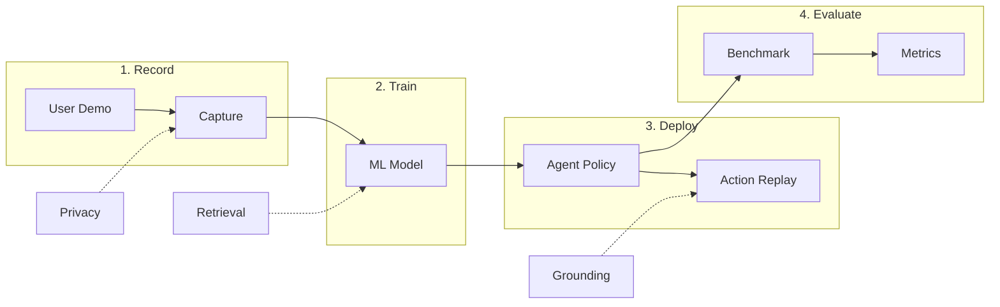

# OpenAdapt

**AI-First Process Automation with Large Multimodal Models (LMMs)**

OpenAdapt is the **open** source software **adapt**er between Large Multimodal Models (LMMs) and traditional desktop and web GUIs.

Record GUI demonstrations, train ML models, and evaluate agents - all from a unified CLI.

[Join Discord](https://discord.gg/yF527cQbDG){ .md-button .md-button--primary }
[View on GitHub](https://github.com/OpenAdaptAI/OpenAdapt){ .md-button }

---

## What is OpenAdapt?

OpenAdapt bridges the gap between powerful AI models and everyday software automation. Instead of writing complex scripts or learning APIs, you simply:

1. **Record** - Demonstrate a task by doing it yourself
2. **Train** - Let OpenAdapt learn from your demonstration
3. **Deploy** - Run your trained agent to automate the task
4. **Evaluate** - Measure performance on standardized benchmarks



---

## Key Features

### Model Agnostic
Works with any Large Multimodal Model - Claude, GPT-4V, Gemini, Qwen-VL, or your own fine-tuned models.

### Learn from Demonstration
No prompting required. OpenAdapt learns directly from how you perform tasks, automatically generating the right prompts.

### Universal GUI Support
Works with all desktop GUIs including native applications, web browsers, and virtualized environments.

### Open Source
MIT licensed. Full transparency, community-driven development, and no vendor lock-in.

---

## Quick Start

Install OpenAdapt with the features you need:

```bash
pip install openadapt[all]  # Everything
```

Record a demonstration:

```bash
openadapt capture start --name my-task
# Perform your task, then press Ctrl+C
```

Train a model:

```bash
openadapt train start --capture my-task --model qwen3vl-2b
```

Evaluate:

```bash
openadapt eval run --checkpoint training_output/model.pt --benchmark waa
```

See the [Installation Guide](getting-started/installation.md) for detailed setup instructions.

---

## Architecture

OpenAdapt v1.0+ uses a **modular meta-package architecture**. The main `openadapt` package provides a unified CLI and depends on focused sub-packages:

| Package | Description |
|---------|-------------|
| [openadapt-capture](packages/capture.md) | Event recording and storage |
| [openadapt-ml](packages/ml.md) | ML engine, training, inference |
| [openadapt-evals](packages/evals.md) | Benchmark evaluation |
| [openadapt-viewer](packages/viewer.md) | HTML visualization |
| [openadapt-grounding](packages/grounding.md) | UI element localization |
| [openadapt-retrieval](packages/retrieval.md) | Multimodal demo retrieval |
| [openadapt-privacy](packages/privacy.md) | PII/PHI scrubbing |

See the full [Architecture Documentation](architecture.md) for detailed diagrams.

---

## Demos

- [Twitter Demo](https://twitter.com/abrichr/status/1784307190062342237)
- [Loom Walkthrough](https://www.loom.com/share/9d77eb7028f34f7f87c6661fb758d1c0)

---

## Community

- **Discord**: [Join our community](https://discord.gg/yF527cQbDG)
- **GitHub**: [OpenAdaptAI](https://github.com/OpenAdaptAI)
- **Twitter**: [@OpenAdaptAI](https://twitter.com/OpenAdaptAI)

---

## License

OpenAdapt is released under the [MIT License](https://github.com/OpenAdaptAI/OpenAdapt/blob/main/LICENSE).
