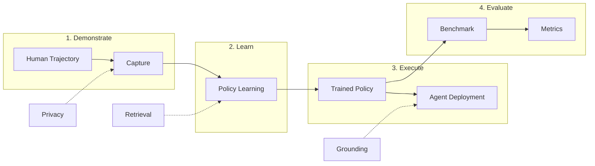

# OpenAdapt

**AI-First Process Automation with Large Multimodal Models (LMMs)**

OpenAdapt is the open source software adapter between Large Multimodal Models (LMMs) and traditional desktop and web GUIs.

Collect human demonstrations, learn agent policies, and evaluate autonomous execution - all from a unified CLI.

[Join Discord](https://discord.gg/yF527cQbDG){ .md-button .md-button--primary }
[View on GitHub](https://github.com/OpenAdaptAI/OpenAdapt){ .md-button }

---

## What is OpenAdapt?

OpenAdapt bridges the gap between powerful AI models and everyday software automation. Instead of writing complex scripts or learning APIs, you simply:

1. **Demonstrate** - Show the agent how to perform a task by doing it yourself
2. **Learn** - Let OpenAdapt learn an agent policy from your demonstration trajectory
3. **Execute** - Deploy your trained agent to autonomously perform the task
4. **Evaluate** - Measure agent performance on standardized benchmarks



---

## Key Features

### Model Agnostic
Works with any Large Multimodal Model - Claude, GPT-4V, Gemini, Qwen-VL, or your own fine-tuned models.

### Learn from Demonstration
No manual prompt engineering required. OpenAdapt learns agent policies directly from your demonstration trajectories.

### Universal GUI Support
Works with all desktop GUIs including native applications, web browsers, and virtualized environments.

### Open Source
MIT licensed. Full transparency, community-driven development, and no vendor lock-in.

---

## Quick Start

### Installation

Install OpenAdapt with the features you need:

```bash
pip install openadapt[all]  # Everything
```

**What You'll See:**
```
Successfully installed openadapt-1.0.0
Successfully installed openadapt-capture-1.0.0
Successfully installed openadapt-ml-1.0.0
Successfully installed openadapt-evals-1.0.0
...
```

### Collect a Demonstration

```bash
openadapt capture start --name my-task
# Perform your task, then press Ctrl+C
```

**What You'll See:**
```
[INFO] Starting capture session: my-task
[INFO] Recording started. Press Ctrl+C to stop.
[INFO] Capturing events...
^C
[INFO] Capture stopped
[INFO] Saved 127 events to database
[SUCCESS] Capture 'my-task' completed successfully
```

### Learn a Policy

```bash
openadapt train start --capture my-task --model qwen3vl-2b
```

**What You'll See:**
```
[INFO] Loading capture: my-task
[INFO] Found 127 events
[INFO] Initializing model: qwen3vl-2b
[INFO] Starting training...
Epoch 1/10: 100%|████████████| 127/127 [00:45<00:00]
Epoch 2/10: 100%|████████████| 127/127 [00:43<00:00]
...
[SUCCESS] Training complete. Model saved to: training_output/model.pt
```

### Evaluate

```bash
openadapt eval run --checkpoint training_output/model.pt --benchmark waa
```

**What You'll See:**
```
[INFO] Loading checkpoint: training_output/model.pt
[INFO] Running benchmark: waa
[INFO] Processing task 1/10...
[INFO] Processing task 2/10...
...
[SUCCESS] Evaluation complete
Results:
  Success Rate: 85.0%
  Average Steps: 12.3
  Total Time: 5m 32s
```

**Success Indicators:**
- Green checkmarks or `[SUCCESS]` messages indicate completion
- No error or warning messages in the output
- Output files created in expected locations
- Metrics show reasonable values (success rate > 0%)

See the [Installation Guide](getting-started/installation.md) for detailed setup instructions.

---

## Architecture

OpenAdapt v1.0+ uses a **modular meta-package architecture**. The main `openadapt` package provides a unified CLI and depends on focused sub-packages:

| Package | Description |
|---------|-------------|
| [openadapt-capture](packages/capture.md) | Demonstration collection and storage |
| [openadapt-ml](packages/ml.md) | Policy learning, training, inference |
| [openadapt-evals](packages/evals.md) | Benchmark evaluation |
| [openadapt-viewer](packages/viewer.md) | Trajectory visualization |
| [openadapt-grounding](packages/grounding.md) | UI element grounding |
| [openadapt-retrieval](packages/retrieval.md) | Trajectory retrieval |
| [openadapt-privacy](packages/privacy.md) | PII/PHI scrubbing |

See the full [Architecture Documentation](architecture.md) for detailed diagrams.

---

## Demos

- [Twitter Demo](https://twitter.com/abrichr/status/1784307190062342237)
- [Loom Walkthrough](https://www.loom.com/share/9d77eb7028f34f7f87c6661fb758d1c0)

---

## Community

- **Discord**: [Join our community](https://discord.gg/yF527cQbDG)
- **GitHub**: [OpenAdaptAI](https://github.com/OpenAdaptAI)
- **Twitter**: [@OpenAdaptAI](https://twitter.com/OpenAdaptAI)

---

## License

OpenAdapt is released under the [MIT License](https://github.com/OpenAdaptAI/OpenAdapt/blob/main/LICENSE).
