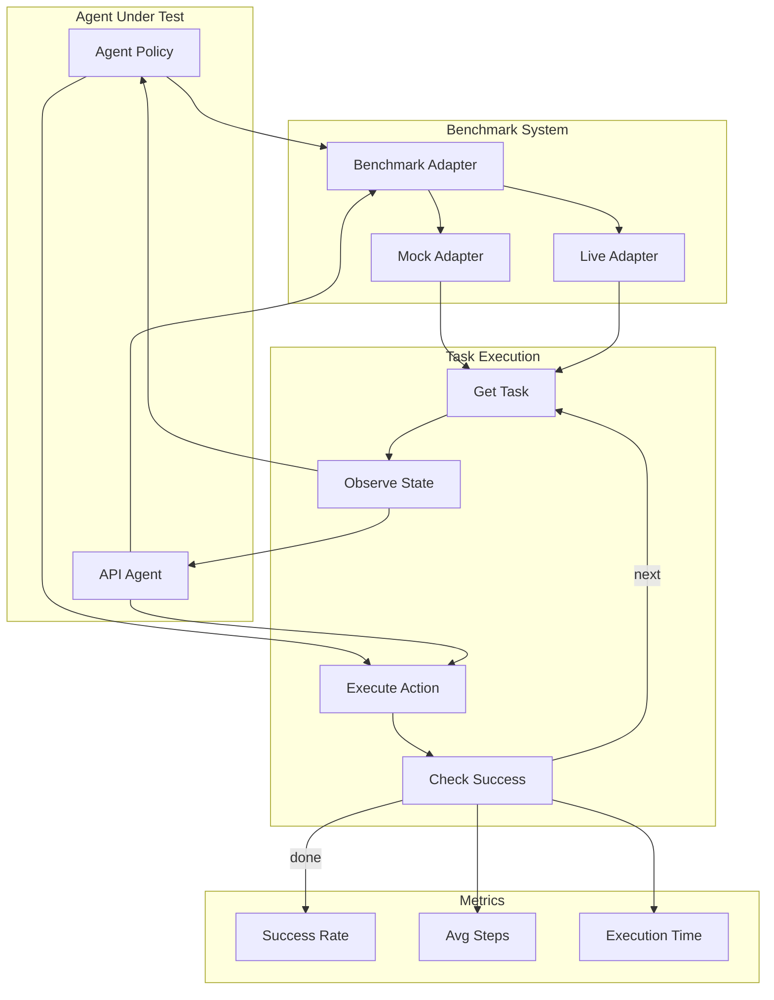

# openadapt-evals

Benchmark evaluation infrastructure for GUI automation agents.

**Repository**: [OpenAdaptAI/openadapt-evals](https://github.com/OpenAdaptAI/openadapt-evals)

## Installation

```bash
pip install openadapt[evals]
# or
pip install openadapt-evals
```

## Overview

The evals package provides:

- Benchmark adapters for standardized evaluation
- API agent implementations (Claude, GPT-4V)
- Evaluation runners and metrics
- Mock environments for testing

## CLI Commands

### Run Evaluation

```bash
# Evaluate a trained model
openadapt eval run --checkpoint training_output/model.pt --benchmark waa

# Evaluate an API agent
openadapt eval run --agent api-claude --benchmark waa
```

Options:

- `--checkpoint` - Path to model checkpoint
- `--agent` - Agent type (api-claude, api-gpt4v, custom)
- `--benchmark` - Benchmark name (waa, osworld, etc.)
- `--tasks` - Number of tasks to evaluate (default: all)
- `--output` - Output directory for results

### Run Mock Evaluation

Test your setup without running actual benchmarks:

```bash
openadapt eval mock --tasks 10
```

### List Available Benchmarks

```bash
openadapt eval benchmarks
```

## Supported Benchmarks

| Benchmark | Description | Tasks |
|-----------|-------------|-------|
| `waa` | Windows Agent Arena | 154 |
| `osworld` | OSWorld | 369 |
| `webarena` | WebArena | 812 |
| `mock` | Mock benchmark for testing | Configurable |

## API Agents

### Claude Agent

```bash
export ANTHROPIC_API_KEY=your-key-here
openadapt eval run --agent api-claude --benchmark waa
```

### GPT-4V Agent

```bash
export OPENAI_API_KEY=your-key-here
openadapt eval run --agent api-gpt4v --benchmark waa
```

## Python API

```python
from openadapt_evals import ApiAgent, BenchmarkAdapter, evaluate_agent_on_benchmark

# Create an API agent
agent = ApiAgent.claude()

# Or load a trained model
from openadapt_ml import AgentPolicy
agent = AgentPolicy.from_checkpoint("model.pt")

# Run evaluation
results = evaluate_agent_on_benchmark(
    agent=agent,
    benchmark="waa",
    num_tasks=10
)

print(f"Success rate: {results.success_rate:.2%}")
print(f"Average steps: {results.avg_steps:.1f}")
```

## Evaluation Loop



## Key Exports

| Export | Description |
|--------|-------------|
| `ApiAgent` | API-based agent (Claude, GPT-4V) |
| `BenchmarkAdapter` | Benchmark interface |
| `MockAdapter` | Mock benchmark for testing |
| `evaluate_agent_on_benchmark` | Evaluation function |
| `EvalResults` | Evaluation results container |

## Metrics

| Metric | Description |
|--------|-------------|
| Success Rate | Percentage of tasks completed successfully |
| Average Steps | Mean number of steps per task |
| Execution Time | Total and per-task timing |
| Error Rate | Percentage of tasks that errored |

## Related Packages

- [openadapt-ml](ml.md) - Train models to evaluate
- [openadapt-capture](capture.md) - Record training data
