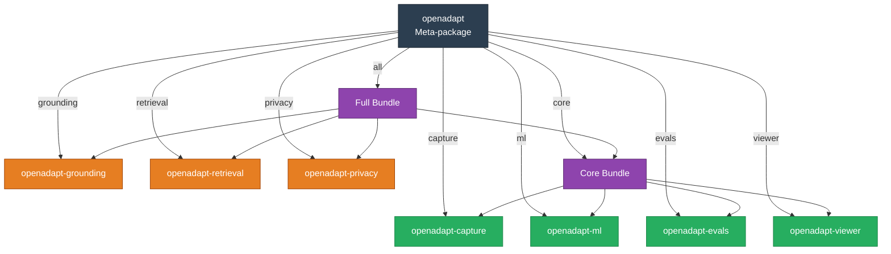
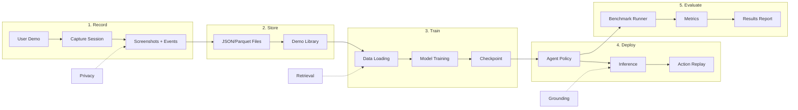

# Packages Overview

OpenAdapt v1.0+ uses a modular meta-package architecture. The main `openadapt` package provides a unified CLI and depends on focused sub-packages via PyPI.

## Architecture



## Core Packages

These packages provide the essential functionality for recording, training, evaluating, and visualizing.

| Package | Description | Install Extra |
|---------|-------------|---------------|
| [openadapt-capture](capture.md) | GUI recording, event capture, storage | `capture` |
| [openadapt-ml](ml.md) | ML engine, training, inference | `ml` |
| [openadapt-evals](evals.md) | Benchmark evaluation infrastructure | `evals` |
| [openadapt-viewer](viewer.md) | HTML visualization components | `viewer` |

Install all core packages:

```bash
pip install openadapt[core]
```

## Optional Packages

These packages provide enhanced functionality for specific use cases.

| Package | Description | Install Extra |
|---------|-------------|---------------|
| [openadapt-grounding](grounding.md) | UI element localization | `grounding` |
| [openadapt-retrieval](retrieval.md) | Multimodal demonstration retrieval | `retrieval` |
| [openadapt-privacy](privacy.md) | PII/PHI scrubbing | `privacy` |

Install all packages:

```bash
pip install openadapt[all]
```

## Installation Options

### Individual Packages

```bash
pip install openadapt[capture]     # GUI capture/recording
pip install openadapt[ml]          # ML training and inference
pip install openadapt[evals]       # Benchmark evaluation
pip install openadapt[viewer]      # HTML visualization
pip install openadapt[grounding]   # UI element localization
pip install openadapt[retrieval]   # Demo search/retrieval
pip install openadapt[privacy]     # PII/PHI scrubbing
```

### Multiple Packages

```bash
pip install openadapt[capture,ml,evals]
```

### Bundles

```bash
pip install openadapt[core]        # capture + ml + evals + viewer
pip install openadapt[all]         # Everything
```

## Data Flow



## Package Repositories

Each package is maintained in its own repository:

| Package | Repository |
|---------|------------|
| openadapt | [OpenAdaptAI/OpenAdapt](https://github.com/OpenAdaptAI/OpenAdapt) |
| openadapt-capture | [OpenAdaptAI/openadapt-capture](https://github.com/OpenAdaptAI/openadapt-capture) |
| openadapt-ml | [OpenAdaptAI/openadapt-ml](https://github.com/OpenAdaptAI/openadapt-ml) |
| openadapt-evals | [OpenAdaptAI/openadapt-evals](https://github.com/OpenAdaptAI/openadapt-evals) |
| openadapt-viewer | [OpenAdaptAI/openadapt-viewer](https://github.com/OpenAdaptAI/openadapt-viewer) |
| openadapt-grounding | [OpenAdaptAI/openadapt-grounding](https://github.com/OpenAdaptAI/openadapt-grounding) |
| openadapt-retrieval | [OpenAdaptAI/openadapt-retrieval](https://github.com/OpenAdaptAI/openadapt-retrieval) |
| openadapt-privacy | [OpenAdaptAI/openadapt-privacy](https://github.com/OpenAdaptAI/openadapt-privacy) |

## Contributing

To contribute to a specific package:

1. Fork and clone the package repository
2. Install in development mode: `pip install -e ".[dev]"`
3. Make your changes
4. Submit a pull request

See [Contributing](../contributing.md) for more details.
