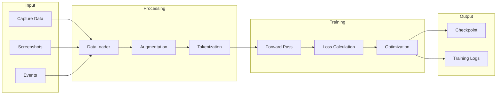

# openadapt-ml

ML engine, training, and inference for GUI automation agents.

**Repository**: [OpenAdaptAI/openadapt-ml](https://github.com/OpenAdaptAI/openadapt-ml)

## Installation

```bash
pip install openadapt[ml]
# or
pip install openadapt-ml
```

## Overview

The ML package provides:

- Model adapters for various LMMs (Qwen-VL, LLaVA, etc.)
- Training infrastructure for supervised learning
- Inference engine for action prediction
- Agent policies for deployment

## CLI Commands

### Start Training

```bash
openadapt train start --capture my-task --model qwen3vl-2b
```

Options:

- `--capture` - Name of the capture to train on (required)
- `--model` - Model architecture (required)
- `--epochs` - Number of training epochs (default: 10)
- `--batch-size` - Batch size (default: 4)
- `--output` - Output directory (default: training_output/)

### Check Training Status

```bash
openadapt train status
```

### Stop Training

```bash
openadapt train stop
```

### List Available Models

```bash
openadapt train models
```

## Supported Models

| Model | Size | Description |
|-------|------|-------------|
| `qwen3vl-2b` | 2B | Qwen3-VL 2B parameters |
| `qwen3vl-7b` | 7B | Qwen3-VL 7B parameters |
| `llava-1.6-7b` | 7B | LLaVA 1.6 7B parameters |
| `custom` | - | Custom model configuration |

## Python API

```python
from openadapt_ml import QwenVLAdapter, Trainer, AgentPolicy

# Load a pre-trained model
adapter = QwenVLAdapter.from_pretrained("qwen3vl-2b")

# Create trainer
trainer = Trainer(
    model=adapter,
    capture_name="my-task",
    epochs=10
)

# Train
checkpoint_path = trainer.train()

# Load for inference
policy = AgentPolicy.from_checkpoint(checkpoint_path)

# Predict next action
screenshot = load_screenshot()
action = policy.predict(screenshot)
```

## Training Pipeline



## Key Exports

| Export | Description |
|--------|-------------|
| `QwenVLAdapter` | Qwen-VL model adapter |
| `LLaVAAdapter` | LLaVA model adapter |
| `Trainer` | Training infrastructure |
| `AgentPolicy` | Inference policy |
| `train_supervised` | Training function |

## Hardware Requirements

| Model | VRAM | Recommended GPU |
|-------|------|-----------------|
| qwen3vl-2b | 8GB | RTX 3070+ |
| qwen3vl-7b | 24GB | RTX 4090 / A100 |
| llava-1.6-7b | 24GB | RTX 4090 / A100 |

## Related Packages

- [openadapt-capture](capture.md) - Record training data
- [openadapt-evals](evals.md) - Evaluate trained models
- [openadapt-retrieval](retrieval.md) - Few-shot retrieval for training
