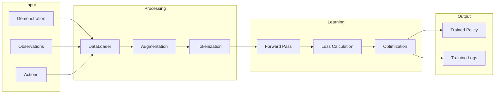
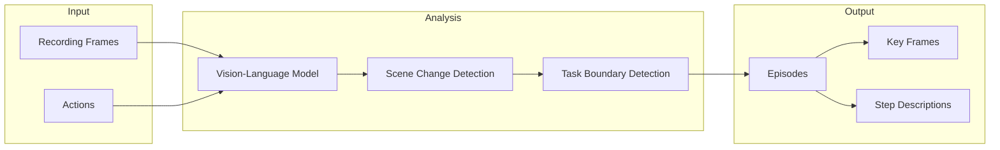

# openadapt-ml

Policy learning, training, and inference for GUI automation agents.

**Repository**: [OpenAdaptAI/openadapt-ml](https://github.com/OpenAdaptAI/openadapt-ml)

## Installation

```bash
pip install openadapt[ml]
# or
pip install openadapt-ml
```

## Overview

The ML package provides:

- Model adapters for various LMMs (Qwen-VL, LLaVA, etc.)
- Policy learning infrastructure from demonstration trajectories
- Inference engine for action prediction
- Agent policies for autonomous execution

## CLI Commands

### Start Policy Learning

```bash
openadapt train start --capture my-task --model qwen3vl-2b
```

Options:

- `--capture` - Name of the demonstration to learn from (required)
- `--model` - Model architecture (required)
- `--epochs` - Number of training epochs (default: 10)
- `--batch-size` - Batch size (default: 4)
- `--output` - Output directory (default: training_output/)

### Check Policy Learning Status

```bash
openadapt train status
```

### Stop Policy Learning

```bash
openadapt train stop
```

### List Available Models

```bash
openadapt train models
```

## Supported Models

| Model | Size | Description |
|-------|------|-------------|
| `qwen3vl-2b` | 2B | Qwen3-VL 2B parameters |
| `qwen3vl-7b` | 7B | Qwen3-VL 7B parameters |
| `llava-1.6-7b` | 7B | LLaVA 1.6 7B parameters |
| `custom` | - | Custom model configuration |

## Python API

```python
from openadapt_ml import QwenVLAdapter, Trainer, AgentPolicy

# Load a pre-trained model
adapter = QwenVLAdapter.from_pretrained("qwen3vl-2b")

# Create trainer for policy learning
trainer = Trainer(
    model=adapter,
    demonstration="my-task",  # demonstration name
    epochs=10
)

# Learn policy from demonstration trajectory
checkpoint_path = trainer.train()

# Load trained policy for execution
policy = AgentPolicy.from_checkpoint(checkpoint_path)

# Predict next action from observation
observation = load_screenshot()
action = policy.predict(observation)
```

## Policy Learning Pipeline



## Key Exports

| Export | Description |
|--------|-------------|
| `QwenVLAdapter` | Qwen-VL model adapter |
| `LLaVAAdapter` | LLaVA model adapter |
| `Trainer` | Policy learning infrastructure |
| `AgentPolicy` | Trained policy for execution |
| `learn_from_demonstrations` | Policy learning function |

## Hardware Requirements

| Model | VRAM | Recommended GPU |
|-------|------|-----------------|
| qwen3vl-2b | 8GB | RTX 3070+ |
| qwen3vl-7b | 24GB | RTX 4090 / A100 |
| llava-1.6-7b | 24GB | RTX 4090 / A100 |

## Episode Segmentation

**NEW (January 2026)**: Automatically segment recordings into distinct task episodes using ML.

### Overview

Episode segmentation analyzes long recordings and identifies natural task boundaries, breaking them into semantic episodes. This enables:

- **Better Training Data**: Train on specific tasks rather than entire recordings
- **Task Discovery**: Understand what tasks users actually perform
- **Demo Library**: Build searchable library of task examples
- **Few-Shot Learning**: Find relevant examples for new tasks

### CLI Commands

```bash
# Segment a recording into episodes
openadapt ml segment --recording turn-off-nightshift --output episodes.json

# Segment with custom model
openadapt ml segment --recording my-task --model qwen3vl-7b

# Batch segment all recordings
openadapt ml segment --all --output-dir segmentation_output/

# View segmentation results
openadapt ml view-episodes --file episodes.json
```

### Python API

```python
from openadapt_ml import EpisodeSegmenter, generate_episode_library

# Segment a single recording
segmenter = EpisodeSegmenter(model="qwen3vl-2b")
episodes = segmenter.segment_recording("turn-off-nightshift")

# Generate episode library from multiple recordings
library = generate_episode_library(
    recordings=["recording1", "recording2"],
    output_path="episode_library.json"
)

# Access episode data
for episode in episodes:
    print(f"{episode.name}: {len(episode.steps)} steps")
    print(f"Frames: {episode.start_frame} - {episode.end_frame}")
```

### Episode Schema

```python
{
    "episode_id": "turn-off-nightshift_001",
    "recording_name": "turn-off-nightshift",
    "name": "Disable Night Shift",
    "description": "Navigate to System Settings and disable Night Shift feature",
    "start_frame": 0,
    "end_frame": 45,
    "duration_seconds": 12.5,
    "key_frames": [0, 15, 30, 45],  # Representative frames
    "steps": [
        "Open System Settings",
        "Navigate to Displays section",
        "Click Night Shift tab",
        "Toggle Night Shift off"
    ],
    "metadata": {
        "confidence": 0.92,
        "model": "qwen3vl-2b",
        "segmentation_date": "2026-01-17T12:00:00Z"
    }
}
```

### How It Works



### Visualization

Episodes can be visualized using the segmentation viewer:

```bash
# Generate interactive viewer
cd openadapt-viewer
python scripts/generate_segmentation_viewer.py \
    --episodes-file segmentation_output/episodes.json \
    --output viewer.html \
    --open
```

See [openadapt-viewer](viewer.md#episode-segmentation-viewer) for viewer features.

## Related Packages

- [openadapt-capture](capture.md) - Collect demonstrations
- [openadapt-evals](evals.md) - Evaluate trained policies
- [openadapt-retrieval](retrieval.md) - Trajectory retrieval for few-shot policy learning
- [openadapt-viewer](viewer.md) - Visualize episodes and training results
