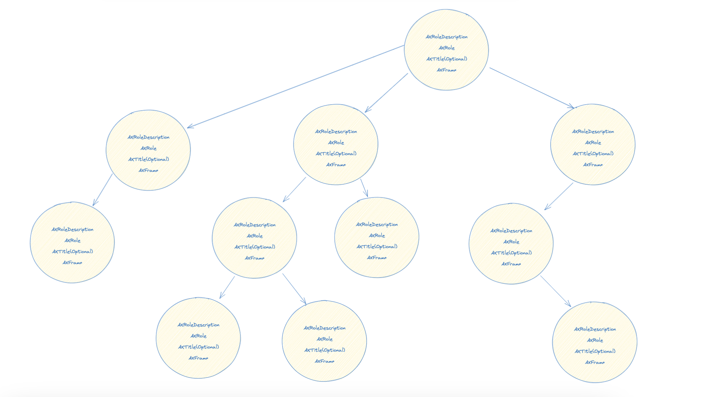

## Background

In an attempt to solve [evaluation pipeline](https://github.com/OpenAdaptAI/OpenAdapt/issues/421), it is realised that one missing key component is the algorithm to determine the actual component of interest on any given window.

Given a reference window and a reference action, we need to fid out what component on the window the action takes effect on. This is critical for any attempt to evaluate any models.

Also, this will set path for future model tuning operation, as one of the key element of fine-tuning and RFHF is to architecture the prompt itself.

Put it simply, the ability to detect key component on the reference window is part of the attempt to ** represent the window UI, translate, summarize the UI into a codified manner from which model can work with **

## Proposal

### Abandoned Ideas

An attempt has been made to [evaluate an action for any given window](https://github.com/OpenAdaptAI/OpenAdapt/pull/444). This attempts to solve the problem by evaluating the following criteria. For any given `active_window` and the `predicted_action` to perform on the active window:

- Any action which is of valid type
- If the action is of type key press, just check the correct key
- If the action is of type mouse movement/click, verify if the position is withint the boundary of the active window.

This idea was abandonned as in the end, it is not helpful for future prompt building and RFLHF processes. I.e: it does not help the model to provide an action that can lead to a potentially correct future state.

*The idea of working directly with coordinates is a wrong approach*

However, this abandonned idea was fundamental in realising the structured question we are facing.

### Restructuring the problem

Active research on the topic was done at [Google AI](https://ai.googleblog.com/2023/02/a-vision-language-approach-for.html). The conclusion was that there are 2 approaches to solve RPA and UI automation problem:

- (1) Represent the UI/DOM in a structured and codified language which make it easy for the LLM model to understand and work with. Then, one or multiple models can be used to perform several tasks: UI extraction, UI summary, UI focus area prediction and UI component action prediction (to tape on or to type on or to tape on then start typing). This approach is coined as *approach based on UI hierachies*
- (2) Using Visions to perform UI related task: UI summary, UI translation, UI action prediction ...etc. This approach is coined as *Vision based approach*

However, the common ground is that, UI automation can be scoped into several independant tasks:

- UI extraction -> To understand and represent the UI
- UI summary -> To summarize the UI into a codified language which makes sense for LLM models to work with.
- UI Focus area -> Given an UI, find the area that should the action focus on
- UI action prediction -> Given the focus area, find the action that should be taken.

In order to evaluate the correctness of an action, it is critical first to find the *Focus Area*, which is the area the action should take place on.

### Hierarchies of the UI

The [abandonned attempt](#Abandoned Ideas) taught us that working directly with coordinate of the UI is a wrong approach. It is first necessary to translate the window UI in to hierarchies in order to work with next steps. Heavily inspired from the Web DOM approach, any given window UI can be represented as a Tree like below:



Each window composes of elements and its children. Each element also has children at lower level.

Each component can be represent by:
- Description: Description of the component
- Role: Role of the component
- Title(Optional): Title of the component, may not exist.
- Frame: cooridates, origin, width, height of the components
- Children elements

On OSX, those elements are presented respectively as:


- `AXRoleDescription`

- `AXRole`

- `AXTitle` (Optional)

- `AXFrame`

- `AXChildrenInNavigationOrder`: Can be empty for leaf node.

Looking at [similar attempt to testing automation on OSX](https://github.com/daveenguyen/atomacos/blob/acb04938917f6db2e8d54205a1022d074339f38b/atomacos/_a11y.py#L45), we can see similarities. It is likely that those elements are enough to represent any given element in an useful manner.

Hence, each node in the tree should contain those key data structures.

An example of a node of an element on OSX:

```JSON
               {
                  "AXFrame":{
                     "x":557.0,
                     "y":30.0,
                     "w":16.0,
                     "h":16.0,
                     "type":"kAXValueCGRectType"
                  },
                  "AXRole":"AXImage",
                  "AXTitle":"OpenAdapt",
                  "AXRoleDescription":"image",
                  "AXChildrenInNavigationOrder": []
               }

```


### Searching for Focus Area on a Window

As an element of the tree is repsented in such manner, potentially, a propmt can be built simply by asking:

```
Given the following component:
- An image with title OpenAdapt
- A button with title Close
- A button with title "Continue"

Which component should I focus on ?
```

However, prompt building is another topic and not in the scope of this RFC

### Evaluate an action on a given window

When a window is represented as a Tree as above, for any given action, it is trivial to evaluate if the action is useful/valid or not.

The problem:

- Given `reference_window`, `reference_action`, `active_window` and `predicted_action`. Evaluate the accuracy of the `predicted_action`

The algorithms to perform are:

*Algorithm 1* : Given `reference_window` and `reference_action`

- Represent `reference_window` in UI tree
- Find the *lowest level leaf-node* of the tree which bounds the location of `reference_action`. If the `reference_action` is of type key board button pressed, then skip, as there is no component to click on.

I.e: A lowest level leaf node represent the smallest component which bounds the action.

*Algorithm 2*: Given `active_window` and `predicted_action`:

- Represent `active_window` in UI tree
- Find the *lowest level leaf-node* of the tree which bounds the location of `predicted_action`. If the `predicted_action` is of type key board button pressed, then skip, as there is no component to click on.

Compare the result of algorithm 1 and algorithm 2 to see if the same component is activated. If yes, then it the `predicted_action` is correct.

*NOTE*: if the `predicted_action` and `reference_action` is of type keyboard press, then it is trivial to compare them and we don't need to perform the above steps.


Finding the lowest level leaf-node in a tree is trivial:

```

- For a given tree, perform BFS or DFS
- If the condition is valid, add the leaf node to result stack, along with the depth level of the node
- For all leaf nodes in result stack, find the leaf node with maximum depth.

```


## Conclusion

This approach will not only solve the evaluation problem, but it also opens the door for new directions of on prompt building, RFLHF. By representing the UI in hierachies, it structurizes the next steps (fine-tuning, prompt building) and set the bases for future designs and implementations.

When a window is represented in hierachies tree, the evaluation of a given action is much easier. Also, with this approach, we can set the direction for [window state summary](https://github.com/OpenAdaptAI/OpenAdapt/issues/442) in a more coherent manner.

Further prompt engineering will be come easier as we can figure out a way to smartly provide relevant information to the LLM models.
