# Quick Start


**Experiencing difficulty? Get support on our** [**Discord**](https://discord.gg/QKPuDqhDHF)**.**


## Installation

OpenAdapt **requires Python3.10**, you can download it [here](https://www.python.org/downloads/) or try our installer, which will download Python for you.&#x20;




First, clone & navigate to the repository:

```
git clone https://github.com/OpenAdaptAI/OpenAdapt.git
cd OpenAdapt
```

If [poetry](https://python-poetry.org) is not installed, you can use pip to install it:

```
pip3 install poetry
```

Lastly, run these lines to setup the environment:

```
poetry install
poetry shell
poetry run postinstall
cd openadapt && alembic upgrade head && cd ..
```





Prerequisite:

- Python 3.10
- Git
- Tesseract (for OCR)
- nvm (node version manager)

```batch
git clone https://github.com/OpenAdaptAI/OpenAdapt.git
cd OpenAdapt
python3.10 -m venv .venv
source .venv/bin/activate
pip install wheel
pip install -r requirements.txt
pip install -e .
alembic upgrade head
```




[Download](https://openadapt.ai/#start)

# Windows:

- Press Windows Key, type "powershell", and press Enter
- Copy and paste the following command into the terminal, and press Enter (If Prompted for `User Account Control`, click 'Yes'):
- `Start-Process powershell -Verb RunAs -ArgumentList '-NoExit', '-ExecutionPolicy', 'Bypass', '-Command', "iwr -UseBasicParsing -Uri 'https://raw.githubusercontent.com/OpenAdaptAI/OpenAdapt/main/install/install_openadapt.ps1' | Invoke-Expression"`

# MacOS:

- Download and install Git and Python 3.10
- Press Command+Space, type "terminal", and press Enter
- Copy and paste the following command into the terminal, and press Enter:
  `/bin/bash -c "$(curl -fsSL https://raw.githubusercontent.com/OpenAdaptAI/OpenAdapt/HEAD/install/install_openadapt.sh)"`




# Permissions(IMPORTANT)

See how to set up system permissions on macOS [here](https://github.com/OpenAdaptAI/OpenAdapt/blob/main/permissions_in_macOS.md).


**Good to know:** After installing OpenAdapt, run\
`pytest` to verify that the installation was successful.


## Usage

# Shell

Run this in every new terminal window once (while inside the `OpenAdapt` root directory) before running any `openadapt` commands below. This is required to activate the pythom environment:

`poetry shell`

You should see the something like this:

```
% poetry shell
Using python3.10 (3.10.13)
...
(openadapt-py3.10) %
```

Notice the environment prefix `(openadapt-py3.10)`.

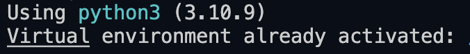

# Make your first recording



Create a new recording by running the following command:

To make your first recording, try the following command:

```sh
python -m openadapt.record "testing out openadapt"
```

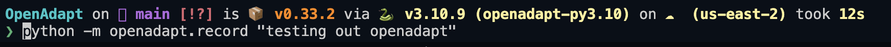

Wait until all three event writers have started:

```bash
| INFO     | __mp_main__:write_events:230 - event_type='screen' starting
| INFO     | __mp_main__:write_events:230 - event_type='action' starting
| INFO     | __mp_main__:write_events:230 - event_type='window' starting
```

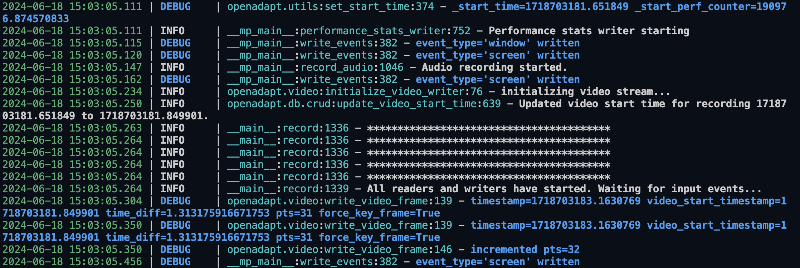

To stop recording, focus the terminal and send **CTRL+C (SIGINT)**. The recording is finished saving when you see something like this:

```bash
| INFO     | __main__:record:637 - joining...
| INFO     | __mp_main__:write_events:221 - event_type='window' done
| INFO     | __mp_main__:write_events:221 - event_type='action' done
| INFO     | __main__:read_screen_events:356 - done
| INFO     | __main__:process_events:126 - done
| INFO     | __mp_main__:write_events:221 - event_type='screen' done
| INFO     | __main__:record:652 - saved recording_timestamp=1686243306.393652
| INFO     | __mp_main__:performance_stats_writer:433 - performance stats writer done
```

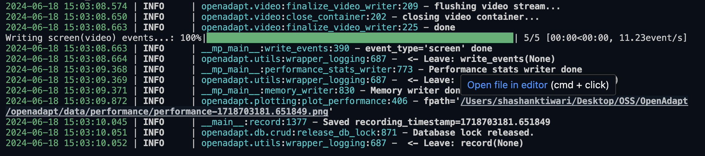

Current limitations:

- Recording should be short (i.e. under a minute), as they are somewhat memory intensive, and there is currently an [open issue](https://github.com/OpenAdaptAI/OpenAdapt/issues/5) describing a possible memory leak.
- The only touchpad and trackpad gestures currently supported are pointing the cursor and left or right clicking, as described in this [open issue](https://github.com/OpenAdaptAI/OpenAdapt/issues/145)

# Visualize

- Quickly visualize the latest recording you created by running the following command:

`python -m openadapt.visualize`

This will generate an HTML file and open a tab in your browser that looks something like this:

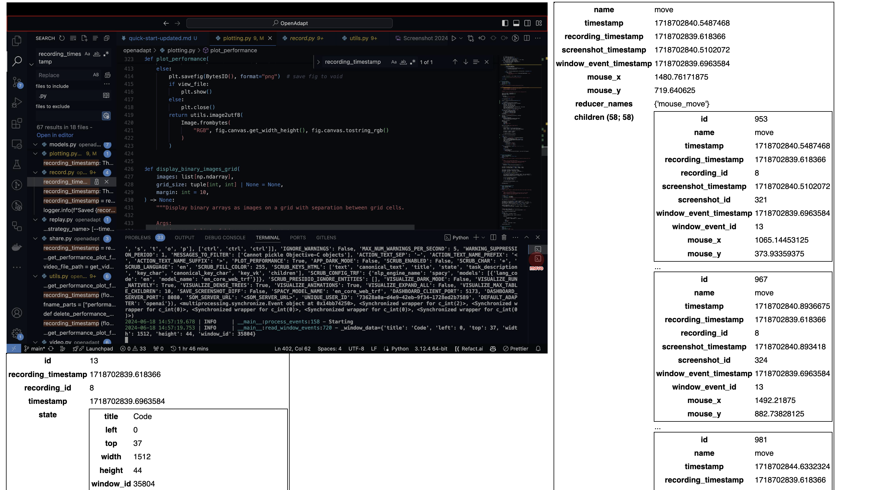

- For a more powerful dashboard, run:

`python -m openadapt.app.dashboard.run`

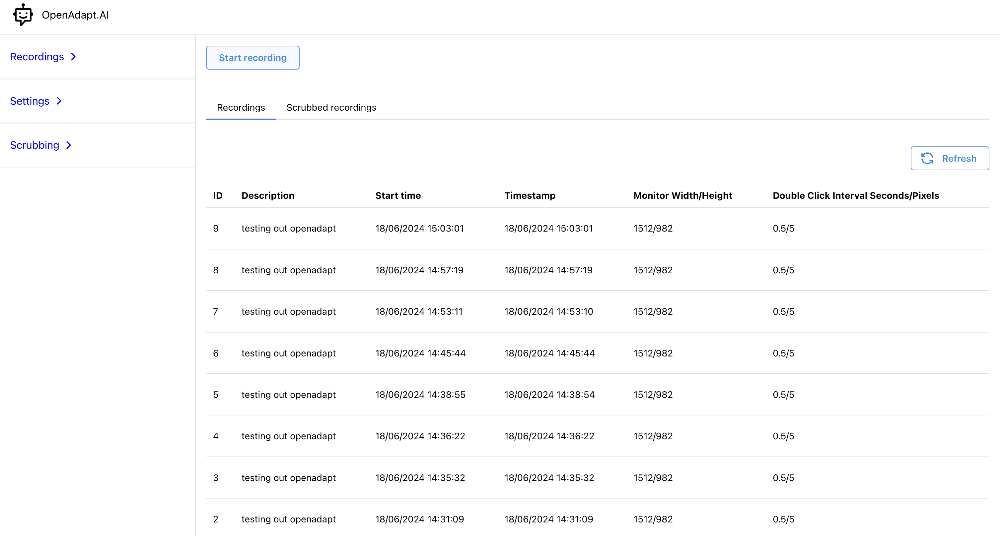

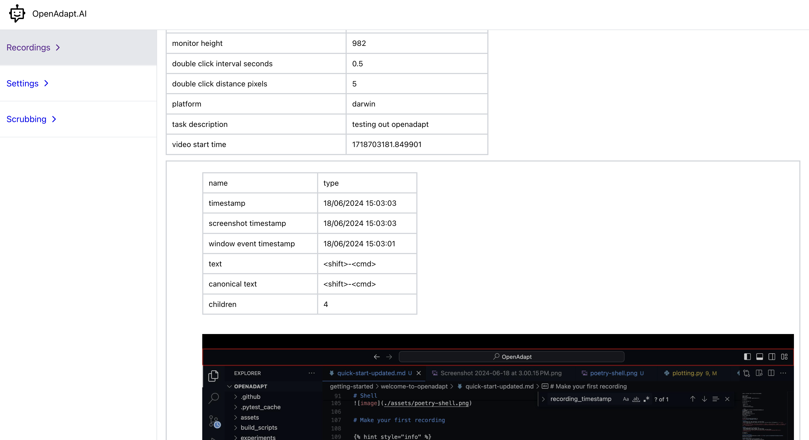

- For a desktop app-based visualization, run:

`python -m openadapt.app.visualize`

Read more on [openadapt.visualize](../../reference/api-reference/openadapt-module/visualize.py.md).

This will open a scrollable window that looks something like this:

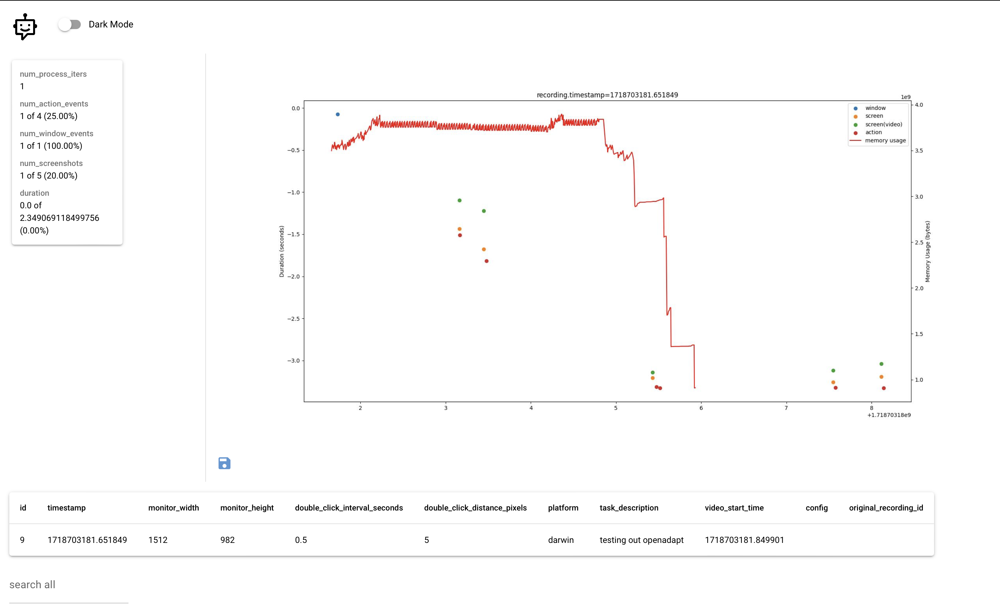

# Playback

You can play back the recording using the following command:

`python -m openadapt.replay NaiveReplayStrategy`

Other replay strategies include:

- [StatefulReplayStrategy](https://github.com/OpenAdaptAI/OpenAdapt/blob/main/openadapt/strategies/stateful.py): Early proof-of-concept which uses the OpenAI GPT-4 API with prompts constructed via OS-level window data.
- [(\*)VisualReplayStrategy](https://github.com/OpenAdaptAI/OpenAdapt/blob/main/openadapt/strategies/visual.py): Uses [Fast Segment Anything Model (FastSAM)](https://github.com/CASIA-IVA-Lab/FastSAM) to segment active window.
- [(\*)VanillaReplayStrategy](https://github.com/OpenAdaptAI/OpenAdapt/blob/main/openadapt/strategies/vanilla.py): Assumes the model is capable of directly reasoning on states and actions accurately. With future frontier models, we hope that this script will suddenly work a lot better.


**Good to know:** The (\*) prefix indicates strategies which accept an "instructions"\
parameter that is used to modify the recording.
e.g.: `python -m openadapt.replay VanillaReplayStrategy --instructions "calculate 9-8"`


See [strategy list](https://github.com/OpenAdaptAI/OpenAdapt/tree/main/openadapt/strategies) for a complete list. More ReplayStrategies coming soon!

## Features

# System Tray Icon and Client GUI App(work-in-progress)

`python3 -m openadapt.start`

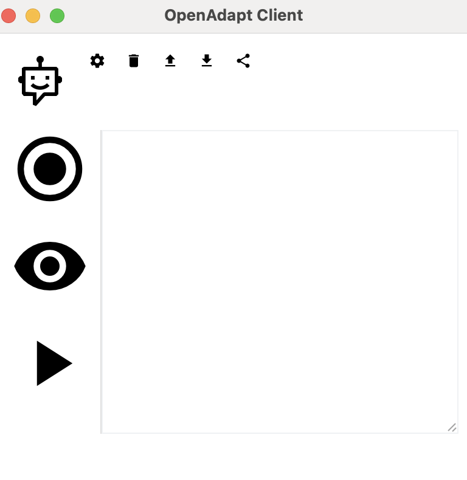

# State-of-the-art GUI understanding via [Segment Anything in High Quality](https://github.com/SysCV/sam-hq):

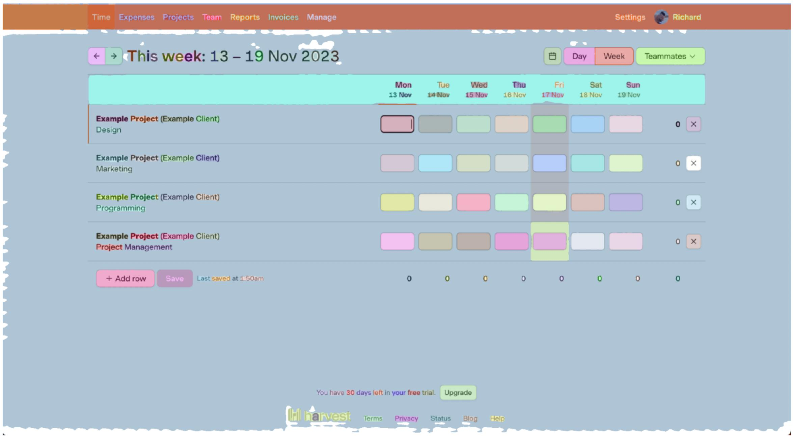

# Industry leading privacy (PII/PHI scrubbing) via [AWS Comprehend](https://aws.amazon.com/comprehend/), [Microsoft Presidio](https://microsoft.github.io/presidio/) and [Private AI](https://www.private-ai.com/en/redact/):


# Decentralized and secure data distribution via [Magic Wormhole](https://github.com/magic-wormhole/magic-wormhole):

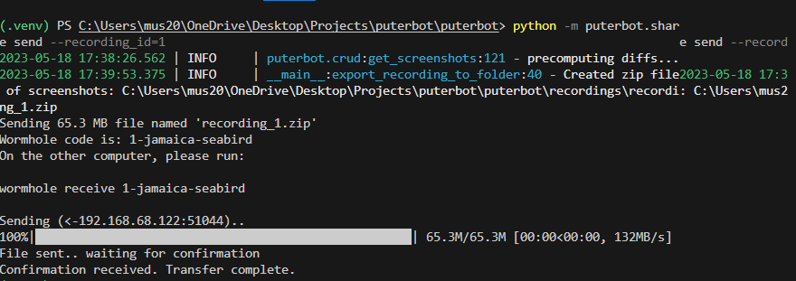

# Detailed performance monitoring via [pympler](https://pympler.readthedocs.io/en/latest/) and [tracemalloc](https://docs.python.org/3/library/tracemalloc.html):


