
**Experiencing difficulty? Get support on our** [**Discord**](https://discord.gg/QKPuDqhDHF)**.**


OpenAdapt **requires Python3.10**, you can download it [here](https://www.python.org/downloads/) or try our installer, which will download Python for you.&#x20;

## Download OpenAdapt

We have builds available for Windows and Mac


**IMPORTANT:** If you are on MAC, you would need to provide some [permissions](https://github.com/OpenAdaptAI/OpenAdapt/blob/main/permissions_in_macOS.md)


- Download the OpenAdapt application from [here](https://openadapt.ai/#start)

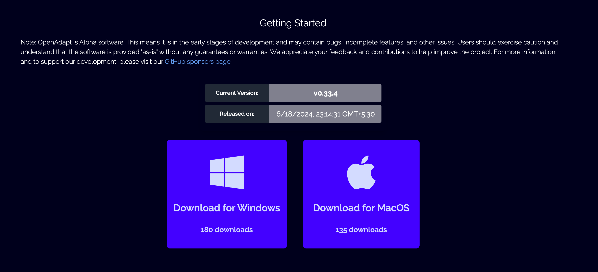

- Extract the zip

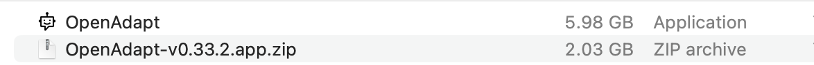

- Click on the extracted application

- It creates an app-tray on top right. This app tray can be used to control the application.

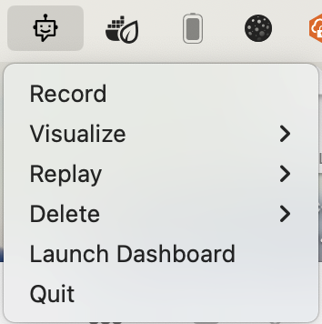

## Start Recording

Now after the application is installed, you can start recording following the steps explained.

- Click the record button in the app-tray

- It opens up a prompt to name your recording

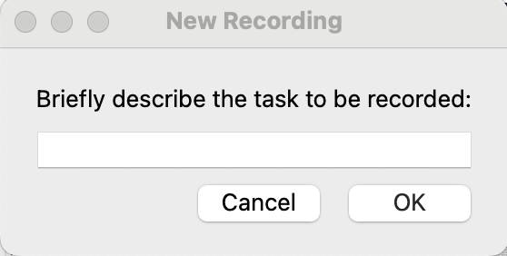

- Give it a name and click ok. Now the recording starts.

## Stop Recording

To end the recording you can simply

- Click the stop recording button in the app-tray and the recording is saved.

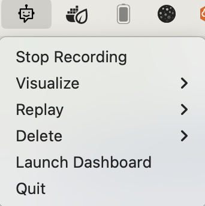

## Replay Recording

To replay the saved recordings

- Click on replay in the app-tray. It opens list of all the recordings.

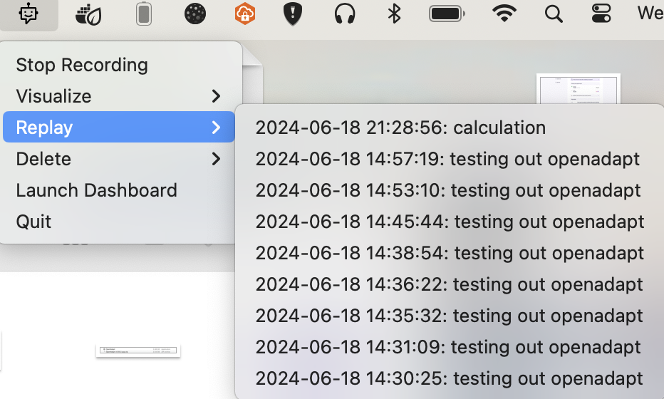

- Click on the recording you want to replay. This will open up a prompt to choose the **replay strategy** & **replay instructions**

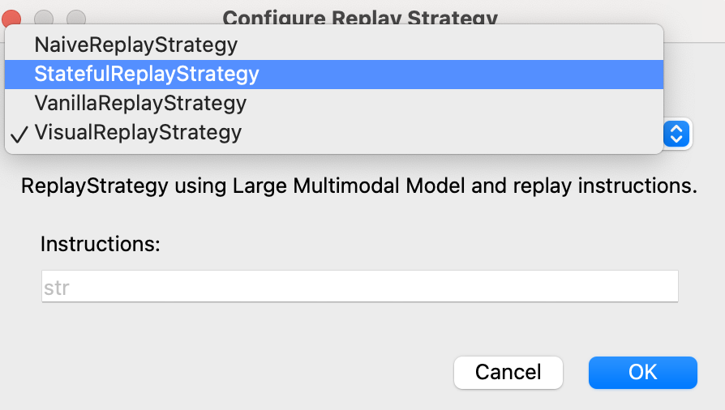


**Good to know:** Read more about strategies [here](./developer-guide.md/#playback)


- Here is a quick [demo](https://openadapt.ai/#demo-video) of how to use replay strategy & instructions.

## Visualize Recording

You can visualize data about your recording events too.

- Click on visualize in the app-tray

- Choose the recording you want to visualize

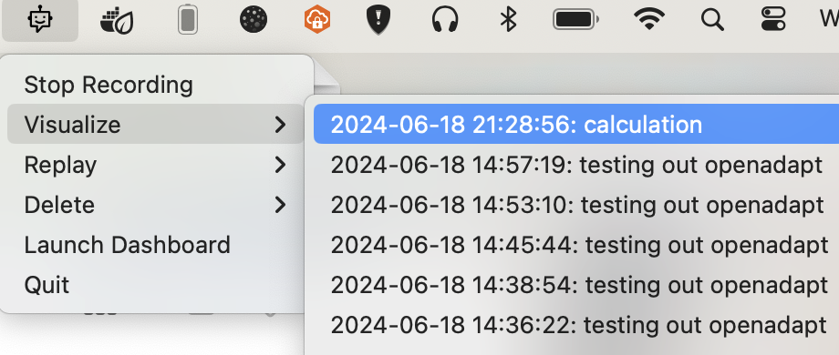

- It opens an HTML page with extensive details about the events in your recordings

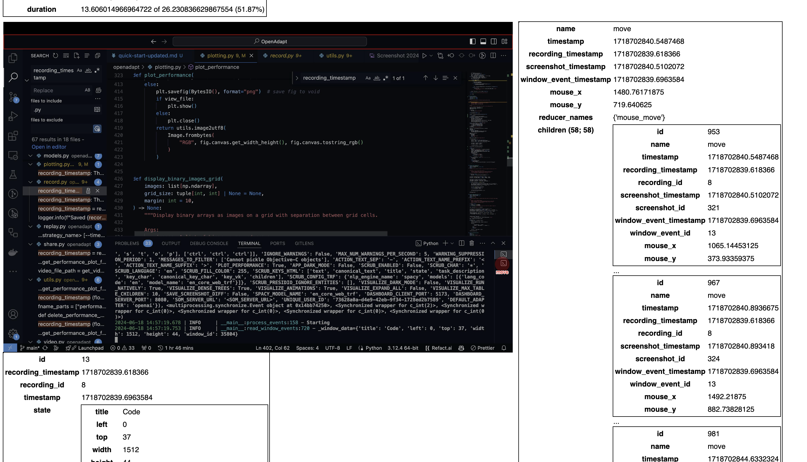

## Delete Recording

If you want to delete any recording from OpenAdapt, you can do it easily.

- Click on delete button in app-tray

- A list of available recordings appear

- Choose the recording to delete

## Dashboard

You can now control OpenAdapt from the GUI recently introduced. You can easily see all the **recordings**, **get recording data**, **change setting such as API keys**, choose to **scrubb a recording**, **replays** etc

- Click on dashboard in the app-tray

- A GUI opens on your browser similar to this

- On settings page you can change API keys, turn on scrub etc

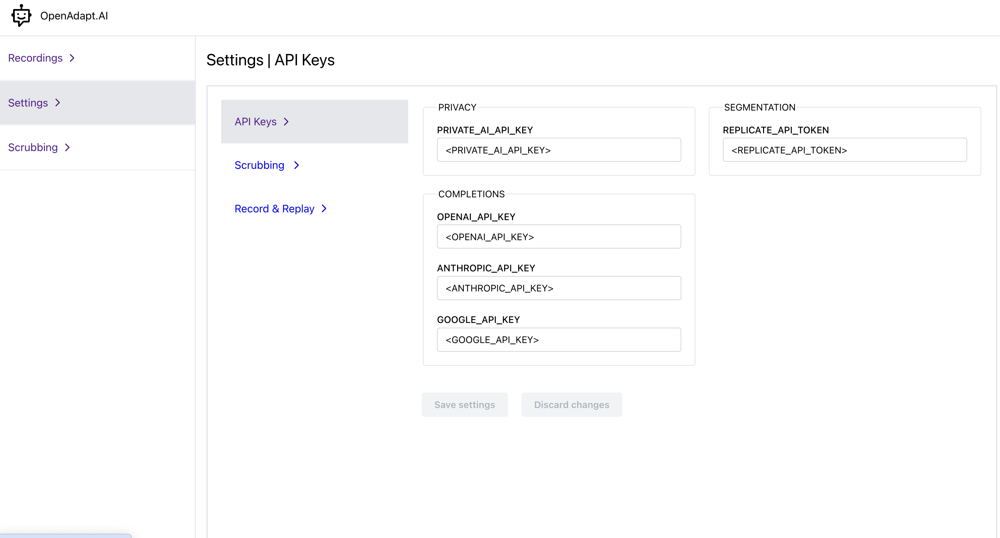

## Scrubbing

You can now scrub a recording of your choice and it gets processed.

- In the dashboard settings, turn on scrubbing.

- Navigate to scrubbing and choose a recording to scrub. Choose the provider

- Now wait for the recording to be processed

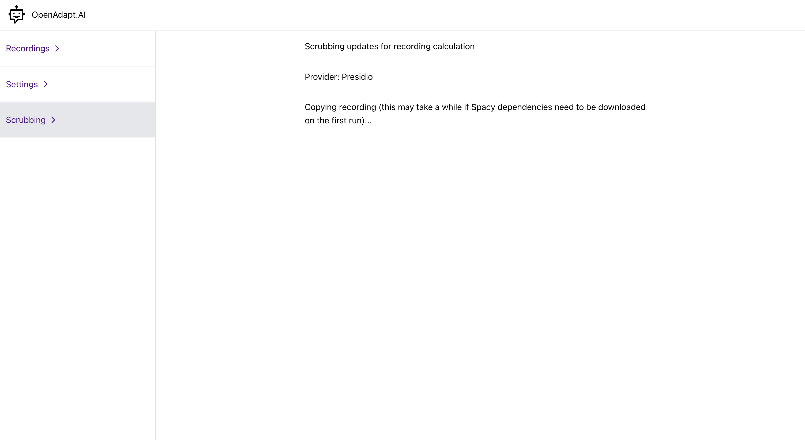 

