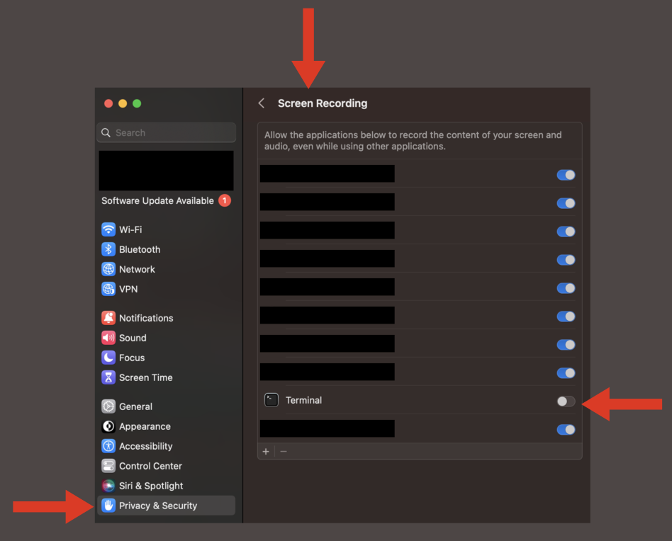

# Setting permissions in macOS

If using macOS, you'll need to set up some permissions to ensure that OpenAdapt works as intended. The following instructions apply to macOS Ventura. Earlier version may present different menus.

Note that while you will be prompted on first run for input monitoring and screen recording permissions, you won't be prompted for accessibility permissions needed for replay of actions. If permission is not granted in that case, replay of actions will silently fail.

## Enabling input monitoring

Input monitoring must be enabled in Settings in order to allow capture of mouse and keyboard input. You can do so by enabling the Terminal application under Settings &#8594; Privacy and security &#8594; Input monitoring &#8594; Allow Terminal

## Enabling screen recording

Screen recoding must be enabled in Settings in order to allow capture of screenshots. You can do so by enabling the Terminal application under Settings &#8594; Privacy and security &#8594; Screen recording &#8594; Allow Terminal

## Enabling replay of actions

Mouse and keyboard control must be enabled in Settings in order to allow replay of actions by the framework. You can do so by enabling the Terminal application under Settings &#8594; Privay and security &#8594; Accessibility &#8594; Allow Terminal

